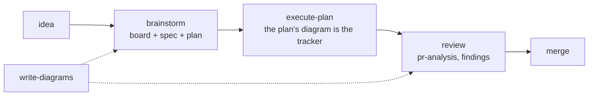
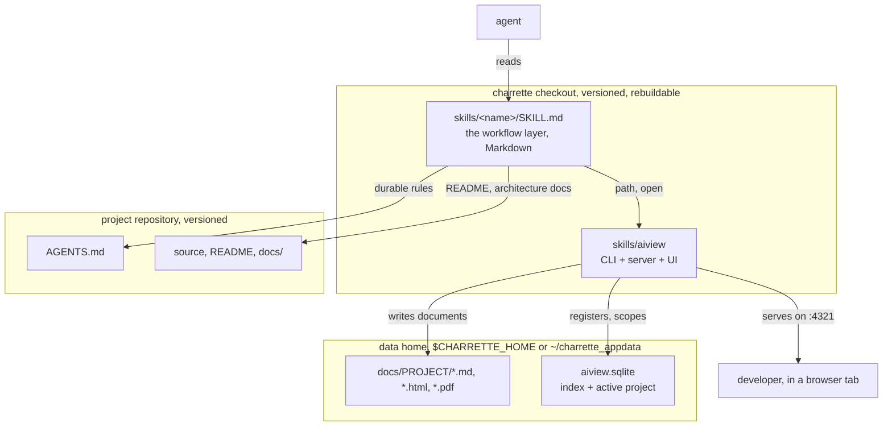

# Charrette

*(French, from architecture studios: the intense working session where a design is
drawn, argued over, and decided before anything expensive is built.)*

**Agent skills for the drawing-board loop: brainstorm → diagram → spec → plan →
execute → review.** The working context between you and an agent: what will be built is
settled in documents, boards, specs, plans, mockups, PR analyses, rendered live in the
bundled viewer ([aiview](skills/aiview/SKILL.md)), with diagrams as thinking tools.

These documents make it unambiguous what is being built, and they are the agent's
context while it is built. Both jobs end when the PR merges, so by default **none of
them are versioned and none live in a project repository.** They go to a data home
outside your repos (`charrette_appdata` in your OS home directory, `$CHARRETTE_HOME` to
move it). The index only points at files, so a document you want in a repo can live
there: ask the agent, and aiview serves it from where it is. The data home itself can
be a git repository of its own, to carry the documents between machines.
What outlives the work is distilled into places that are versioned: durable rules into
`AGENTS.md` via [project-conventions](skills/project-conventions/SKILL.md), the story of
the change into the PR description. [technical-writing](skills/technical-writing/SKILL.md)
is the exception: a README or an architecture doc is a deliverable and belongs in the
repo.

No lock-in: the skills are plain markdown any agent can read, the tooling is plain
Node, skills reference each other by relative path, and nothing depends on a harness,
a plugin format or a cloud service.

## The drawing-board loop



The board is a Markdown file opened at the first question and edited through the whole
conversation. Chat scrolls away, the board is the record. The plan is the same kind of
document for the build: its phasing diagram is the tracker, every step a node with a
status, one node holding the resume state. `execute-plan` runs it without per-step
sign-off and keeps the tracker true. A session that stops mid-phase leaves a plan that
says where the work stands, and a later session, with none of the conversation in
context, picks it up there.

## Layout

Everything the agent loads lives under `skills/`, one flat folder per skill, each
starting with a `SKILL.md` that says when and how to use it. Supporting files
(checklists, catalogs, references) sit alongside. Flat because that is what harnesses
discover, and because it makes every cross-reference the same shape: a skill naming
another names it `../<name>/SKILL.md`, always.

Container diagram: what runs where, and which of the three roots each file belongs to.



Nothing crosses those boundaries by accident: the agent writes documents only through
aiview, and reaches a project repository only for the two things meant to outlive the
work.

## Skills

Once a skill is loaded (its `SKILL.md` pointed to, or discovered by name), the ask is
plain language: each skill states when it applies and maps your request onto its flow.
In the order work usually happens:

| Skill | Use case | Example ask |
|---|---|---|
| [brainstorm](skills/brainstorm/SKILL.md) | A feature, service, or system is about to be built and the design conversation hasn't happened | *"Run brainstorm: I want per-user rate limiting on the API."* Expect one question at a time, a live board in aiview, and no code until the spec and plan are approved. The plan comes with its tracker drawn in. |
| [execute-plan](skills/execute-plan/SKILL.md) | An approved plan is ready to be carried out, or was left mid-way by an earlier session | *"Execute the rate-limiting plan."* The plan opens in aiview and the steps run without per-step sign-off, each node ticking as its done-when is met. It pauses for a decision that is yours, a check that needs your eyes, or an action that does not undo. It refuses a plan with no tracker. |
| [write-diagrams](skills/write-diagrams/SKILL.md) | A design question would settle faster drawn than argued (the other skills also call it for their documents) | *"Use write-diagrams to draw today's login flow: I need to see where the redirect happens."* |
| [frontend-design](skills/frontend-design/SKILL.md) | A screen is about to be built or visually reworked | *"Before we code the settings page, run frontend-design and propose a mockup."* The first run extracts the project's design language; every screen after that is an HTML mockup approved in aiview. |
| [technical-writing](skills/technical-writing/SKILL.md) | A system or procedure needs to be understood by a defined reader | *"Use technical-writing for an architecture doc of the payments service, audience: new backend hires."* |
| [project-conventions](skills/project-conventions/SKILL.md) | A decision was just made, or a repo's unwritten rules need writing down | *"We just settled on soft deletes everywhere: capture that with project-conventions."* Also: *"Harvest this repo's conventions into AGENTS.md."* |
| [pr-review](skills/pr-review/SKILL.md) | A pull request needs an informed merge decision | *"Run pr-review on PR #142."* Reviews in layers, code primitives and structure always, data model, integration and delivery when the diff gives them material, each layer its own subagent. Two documents land in aiview: the full analysis, and a short report with what changed (drawn), what you have to decide, a verdict per layer, and a comment you can post as-is. |
| [code-design-review](skills/code-design-review/SKILL.md) | Program design quality is the question on existing code, in any language | *"Code-design-review the billing module."* DRY, KISS, YAGNI, SOLID, cohesion, coupling. Inside a PR these lenses are already pr-review's; this skill is for code that isn't in one. |
| [frontend-review](skills/frontend-review/SKILL.md) | React/TSX quality is the question | *"Run frontend-review on src/features/checkout."* Findings in chat for a diff; a whole-scope review becomes an aiview report with diagrams. |
| [aiview](skills/aiview/SKILL.md) | Mostly called by the other skills; directly, when a document should be shown or the index queried | *"Open docs/notes/cache-idea.md in aiview, tagged payments."* Also: *"List every document we produced for the payments work."* |

`write-diagrams` and `aiview` are the shared layer the others delegate to. House
rules in `AGENTS.md` win over general principles wherever the two disagree.

## The viewer

aiview is one browser tab on the ongoing work. Every document the skills produce is in
its index, the documents of one piece of work share a container, and each save
re-renders in the open tab.

The two screenshots below are one real piece of work, the redesign of this collection's
own `pr-review` skill into layers. The viewer follows the OS theme.

### A spec, with the work it belongs to

What `brainstorm` leaves behind for one feature: the board, the spec and the plan,
grouped in the sidebar. The spec's diagrams render inline, here the five layers and the
orchestrator that dispatches them. The header shows the document's absolute path, click
to copy.


### The same plan, mid-execution

The plan's phasing diagram is the tracker: every step a node with its status and, once
done, what it found. Done steps are ✅ with their evidence, the gate asks whether the
trials were clean, the one ▶ step is the release in progress, the branch not taken is ✖
with its reason. Above the flow, out of frame, a state node holds branch and commit,
what is deployed, the next step, what is blocked and what is parked. That node is what
makes the plan resumable by a session with none of the conversation in context.

`execute-plan` keeps it true: a node turns ✅ only when its done-when is met, the
tracker is updated before every handoff, deviations are drawn before they are done, the
state node is overwritten, never appended to.


### Mockups that work

A mockup is where you and the agent settle how a screen looks and behaves before it is
coded. It is a working prototype, not a picture: a flow can be walked through, with the
behaviour mocked in the file, so a stepper counts, a promo code applies, a questionnaire
advances. The agent draws what it is told: describe the flow, not only the screen, and
the prototype works instead of only looking right.

The demo below is a shop's cart page.


A screen has states: empty, promo applied, an item out of stock. The mockup declares
them as variants, the viewer exposes them in its toolbar, and the chosen one persists
across reloads.

### Mockups that compose

A component is drawn once, in one mockup, and bound by every screen of the project that
needs it. The cart page binds its parts from a parts sheet, the cart line, the stepper,
the promo field, the checkout button, the badge and the empty state, eleven times in
all.

The **Composition** view outlines what the screen binds from other mockups, in indigo,
and what it exposes to them, in green. The label names source and component. A click on
a bound region opens its source.


The parts sheet in the same view, one outline per exposed component:


The agent gets the same facts from the CLI, `aiview components` and `aiview check`, and
draws by the rules in [frontend-design](skills/frontend-design/SKILL.md): design language
extracted once, every screen approved in the viewer, code after.

| Tool | What it does |
|---|---|
| [aiview](skills/aiview/SKILL.md) | The viewer and its index, one npm package, Node and nothing else. It renders Markdown with mermaid, HTML mockups and PDFs at `localhost:4321`, reloads on save, groups the documents of one piece of work, and files everything per project. The agent drives it from the CLI: `open` a document, `list`, `update`, `move`, `path` to ask where one belongs, `components` and `check` for mockups, `pending` for work still running, every verb with `--json`. Its `SKILL.md` is the contract the other skills follow. |

aiview keeps its index, its server files and every document in the **data home**,
`$CHARRETTE_HOME` or `charrette_appdata` in your OS home directory, never in this
checkout and never in a project repo. The checkout holds nothing you cannot get back
from git. Documents land in `<home>/docs/<project>/`, and that folder name is the
project.

## Using the collection

Prompt for your agent:

> Set up Charrette: clone `https://github.com/Ovich/charrette.git` into
> `<the checkout>`, build the bundled viewer, and make every skill under `skills/`
> discoverable to you (symlink or otherwise). Then tell me the aiview URL and the
> skills you can reach by name.

On Claude Code you can install it as a plugin instead. The skills then answer to
`charrette:`, as `/charrette:pr-review` or `/charrette:brainstorm`, so nothing collides
with skills you already have:

```
/plugin marketplace add Ovich/charrette
/plugin install charrette@charrette
```

## Updating

A checkout takes a prompt, because three things move and only one of them is `git pull`:

> Update Charrette in `<the checkout>`: pull, restart the viewer's server if one is
> running, and repair skill discovery: links made against the old `skills/general/…`
> paths are dangling since the layout flattened. Leave the data home alone. Then tell me
> the aiview URL and the skills you can reach by name.

The viewer's build output arrives with the pull, but a running server keeps serving the
copy it started with until it restarts. Skills are linked rather than copied, so they
update with the pull; links made before the layout flattened point at directories that
no longer exist.

The plugin takes three steps, and the third is not optional, since an update applies
only to a session started after it:

```
/plugin marketplace update charrette
/plugin update charrette@charrette
```

Then restart Claude Code. `/plugin marketplace update` alone refreshes the catalogue
without touching the installed copy, which is why both commands are here.

## License

MIT: see [LICENSE](LICENSE).
