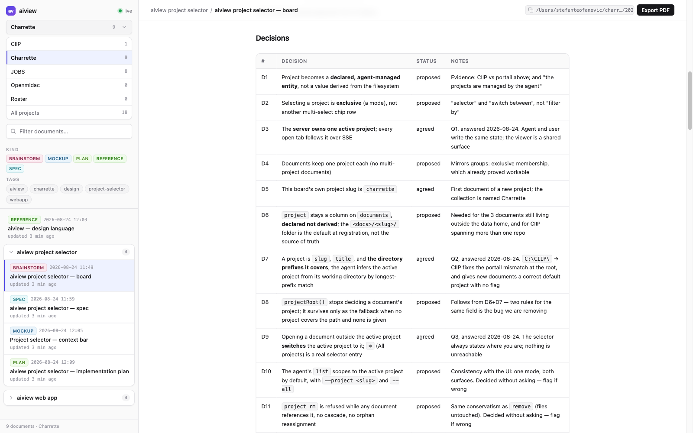

# Charrette

*(French, from architecture studios: the intense working session where a design is
drawn, argued over, and decided before anything expensive is built.)*

**Agent skills for the drawing-board loop: brainstorm → diagram → spec → plan →
review.** Everything is a local document (boards, specs, plans, mockups, PR
analyses) rendered live in the bundled viewer ([aiview](tools/aiview/SKILL.md)),
with diagrams as thinking tools, not decoration.

No lock-in by design: the skills are plain markdown any agent can read, the tooling
is plain Node, references between skills use names plus paths relative to this repo
("in this collection"), and nothing depends on a specific harness, plugin format, or
cloud service.

## Layout

Each skill lives in its own folder and starts with a `SKILL.md` that says when and
how to use it. Supporting files (checklists, catalogs, references) sit alongside.

- `general/`: language- and framework-agnostic, for any codebase.
- `react/`: React and frontend work.
- `tools/`: shared local tooling the skills call into (not skills themselves).

## Skills

Once a skill is loaded (its `SKILL.md` pointed to, or discovered by name), the ask is
plain language: each skill states when it applies and maps your request onto its flow.
In the order work usually happens:

| Skill | Use case | Example ask |
|---|---|---|
| [brainstorm](general/brainstorm/SKILL.md) | A feature, service, or system is about to be built and the design conversation hasn't happened | *"Run brainstorm: I want per-user rate limiting on the API."* Expect one question at a time, a live board in aiview, and no code until the spec and plan are approved. |
| [write-diagrams](general/write-diagrams/SKILL.md) | A design question would settle faster drawn than argued (the other skills also call it for their documents) | *"Use write-diagrams to draw today's login flow: I need to see where the redirect happens."* |
| [frontend-design](general/frontend-design/SKILL.md) | A screen is about to be built or visually reworked | *"Before we code the settings page, run frontend-design and propose a mockup."* The first run extracts the project's design language; every screen after that is an HTML mockup approved in aiview. |
| [technical-writing](general/technical-writing/SKILL.md) | A system or procedure needs to be understood by a defined reader | *"Use technical-writing for an architecture doc of the payments service, audience: new backend hires."* |
| [project-conventions](general/project-conventions/SKILL.md) | A decision was just made, or a repo's unwritten rules need writing down | *"We just settled on soft deletes everywhere: capture that with project-conventions."* Also: *"Harvest this repo's conventions into AGENTS.md."* |
| [pr-review](general/pr-review/SKILL.md) | A pull request needs an informed merge decision | *"Run pr-review on PR #142."* The analysis lands in aiview: quoted intent, delta map, blast radius, decision points, a ready-to-post comment. |
| [code-design-review](general/code-design-review/SKILL.md) | Program design quality is the question, in any language | *"Code-design-review this branch's diff against main."* |
| [frontend-review](react/frontend-review/SKILL.md) | React/TSX quality is the question | *"Run frontend-review on src/features/checkout."* Findings in chat for a diff; a whole-scope review becomes an aiview report with diagrams. |
| [aiview](tools/aiview/SKILL.md) | Mostly called by the other skills; directly, when a document should be shown or the index queried | *"Open docs/notes/cache-idea.md in aiview, tagged payments."* Also: *"List every document we produced for the payments work."* |

They compose, roughly in the order work happens: `brainstorm` designs
the thing and produces the spec and plan; `frontend-design` turns each screen into an
approved mockup before it's built; `project-conventions` records the decisions as
rules in `AGENTS.md`; `pr-review` maps each change so a human can decide the merge;
`code-design-review` judges the implementation against durable general principles and
`frontend-review` judges the React layer on top. `write-diagrams` and `aiview` are
the shared layer all of them delegate to. House rules win over general principles
wherever the two disagree. That's the point of writing them down.

## The viewer

aiview is the collection's central tool: one browser tab with full visibility on the
ongoing work. Every document the skills produce registers in its index, documents that
belong to one piece of work share a container, and each save re-renders in the open
tab. You watch decisions, diagrams, and drafts land as they happen.

| Tool | What it does |
|---|---|
| [aiview](tools/aiview/SKILL.md) | Local document viewer + index in one npm package: React/TypeScript/Tailwind UI, small plain-Node server, agent-facing CLI. Renders Markdown (GFM + mermaid), HTML mockups and PDFs at `localhost:4321` with live reload; related documents grouped in collapsible containers; every doc header shows its absolute path (click-to-copy). CLI: `open` (idempotent register + detached server + URL), `add`, `update`, `list`, `remove`, `serve --detach`, `status`, all with `--json`. Node ≥ 22.5; one-time `npm install && npm run build` in `tools/aiview/`. Its `SKILL.md` is the contract every skill follows (kinds, tags, groups, start time). |

aiview creates its index (`aiview.sqlite`) next to the tool on first use. The file
is gitignored here: it's your machine's document catalog, not the repo's.

## Using the collection

Clone anywhere. Point your agent at a skill's `SKILL.md` (or wire the folder into
your harness's skill discovery, if it has one). Each file is self-contained and
resolves its references relative to this repo. For aiview, run the one-time build in
`tools/aiview/`, then `node tools/aiview/aiview.mjs open <your-doc.md>` is the whole
gesture.

## License

MIT: see [LICENSE](LICENSE).
