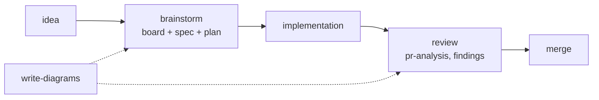
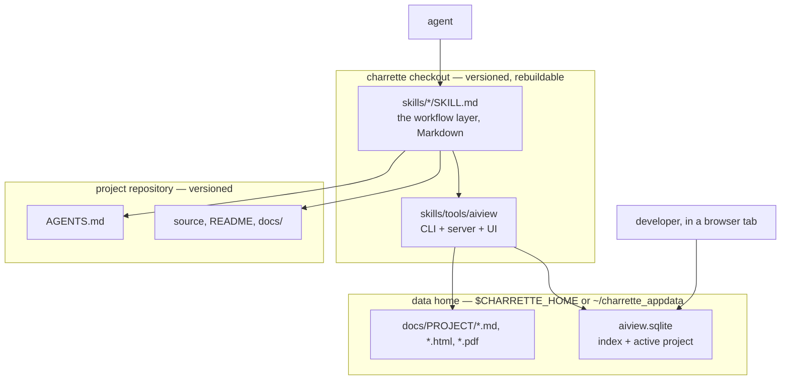

# Charrette

*(French, from architecture studios: the working session where a design is drawn,
argued over, and decided before anything expensive is built.)*

Charrette is a set of agent skills for the drawing-board loop — brainstorm, diagram,
spec, plan, review — plus one local tool that renders what they write. The skills are
plain Markdown an agent reads. The tool, [aiview](skills/tools/aiview/SKILL.md), is a
Node CLI, a small HTTP server and a browser UI that show every document as it changes.
Everything runs on your machine.

## The problem

An agent given a non-trivial task infers whatever it wasn't told. The inference stays
invisible until the diff arrives, which is the most expensive moment to correct it. The
usual reply — write a spec first — creates a second problem: the spec becomes a file in
the repository, gets reviewed, goes stale, and outlives the change it described.

Charrette separates the two concerns. The design becomes a written artifact *before*
implementation, so disagreement surfaces while it is still an argument about a diagram.
The artifact lives *outside* the repository, so it never becomes a second, decaying
account of the project's history.

Every document the skills produce has two jobs:

1. make it unambiguous between a developer and an agent what is being built;
2. be efficient context for the agent while it is built.

Both jobs end when the PR merges. Most of the design follows from that end date.

## The drawing-board loop



The board is a Markdown file opened at the first question and edited through the whole
conversation: a decisions table, the context being built on, the diagrams, the open
questions. Chat scrolls away; the board is the record. The spec and the plan are written
from it, and `brainstorm` refuses to write implementation code until the spec is
approved.

Diagrams are drawn during the argument, not after it. A diagram whose only job is to
illustrate finished prose arrived too late to be worth drawing;
[write-diagrams](skills/general/write-diagrams/SKILL.md) exists to pick the one that
answers the open question and to stop the rest.

Charrette contains no implementation skill. Implementation happens in whatever harness
or editor you already use; the plan is its input, and the review skills judge its
output.

## What becomes durable, and what disappears

| Work product | Where it lives | Lifetime |
|---|---|---|
| Boards, specs, plans, mockups, PR analyses, review reports | The data home, outside every repository | Until the PR merges |
| Rules the next change must follow | `AGENTS.md` / `CLAUDE.md` in the project repository | Until superseded |
| The story of the change | The PR description | The repository's history |
| Documentation that is itself a deliverable (README, architecture doc, runbook) | The project repository, next to the code it describes | Maintained with the code |

The reason for the first row is not that working documents are unimportant. It is that
they are *superseded by the merged code*. A board that reaches the repository must then
be reviewed like code, kept current like code, and read by people who need the code and
not its scaffolding. It gets none of that; it goes stale and starts to lie. Keeping it
outside gives it the lifetime it actually has.

So before a group of documents is retired, whatever outlives it is distilled into a
place that *is* versioned:
[project-conventions](skills/general/project-conventions/SKILL.md) turns decisions into
numbered rules in `AGENTS.md`, and the PR description carries the narrative. The files
themselves stay on disk, indexed, so "what did we decide about X in March" remains
answerable.

[technical-writing](skills/general/technical-writing/SKILL.md) is the deliberate
exception. A README or an architecture doc is a deliverable for whoever clones the
project, so it belongs in the repository and changes in the same commit as the code.
Only that skill's one-off analyses (kind `report`) follow the scaffolding rule.

## Architecture

Three layers, and one boundary that matters more than the others.



**Skills** are the workflow layer. Each is a directory under `skills/` holding a
`SKILL.md` — front matter naming the skill and stating when it applies, then the
procedure — plus any checklists or catalogs it needs. A skill decides *when* an activity
runs and *what shape* its output takes. It never contains code, and it never names a
directory on disk.

**aiview** is shared infrastructure, not a ninth skill. It owns the answers the skills
must not each invent: where a document belongs, how it is registered, how it is
rendered, how the viewer is started. A skill asks `aiview path <filename>` for a
location and calls `aiview open <file>` to make it visible; it never joins a path itself.
That is why the layout can change — as it did when documents moved out of project
repositories into the data home — without editing eight skills.

**The data home** holds everything the checkout cannot regenerate: the SQLite index, the
server's pid and port files, and the documents themselves under `docs/<project>/`. The
checkout holds only what `npm run build` recreates: `app/`, `dist/`, `dist-cli/`,
`node_modules/`. Delete the checkout, clone it again, rebuild — nothing of yours was in
it. `$CHARRETTE_HOME` moves the home; the default is `charrette_appdata` in your OS home
directory. It may be its own git repository, purely to sync between machines: document
paths inside the home are stored relative, so the index travels with it.

**Project repositories** receive only durable knowledge, per the table above.

### Design decisions worth stating

**Skills are Markdown with no manifest.** There is no plugin file, no harness-specific
packaging, no registry. Point an agent at a `SKILL.md`, or wire the `skills/` tree into
whatever discovery your harness offers. The cost is that nothing auto-installs; the
benefit is that the collection outlives any particular agent product.

**References between skills are names plus paths relative to the referencing file.** A
skill in `skills/general/` reaches the viewer at `../../tools/aiview/SKILL.md`, never at
an absolute path. The whole tree therefore moves as one unit — to another directory,
another machine, another user's checkout — without rewriting.

**One viewer, not eight.** Each skill could have printed its output to the terminal or
opened its own file. Instead they all register with aiview, which means: one index that
knows every document across every project, one live-reloading tab rather than a stack of
stale ones, grouping that puts a board next to the spec and plan it produced, and one
place where the layout rules live.

**The viewer is a shared surface.** The server holds one active project, and every open
tab follows it over server-sent events. When the agent runs `aiview use CIIP`, or opens
a document belonging to another project, the tab the developer already has open
re-scopes. Both write the same state through the same endpoint. This is what makes the
documents a shared workspace rather than files the agent writes and the developer hunts
for.

**Plain Node where it runs, React only in the browser.** The CLI and server use built-in
modules — `node:sqlite` for the index (hence Node ≥ 22.5), `node:http`, `fs.watch` — with
no runtime framework. The UI is React and Tailwind, built ahead of time by Vite into
static files the server hands out. Nothing calls a network service.

## Skills

Once a skill is loaded, ask in plain language: *"Run brainstorm: I want per-user rate
limiting on the API."* Each skill states when it applies and maps the request onto its
flow. In the order work usually happens:

| Skill | Use when | Produces |
|---|---|---|
| [brainstorm](skills/general/brainstorm/SKILL.md) | A feature, service, or system is about to be built and the design conversation hasn't happened | A live board (decisions table, diagrams, open questions), then an approved spec and a phased plan. No code until the spec is approved |
| [write-diagrams](skills/general/write-diagrams/SKILL.md) | A design question would settle faster drawn than argued; the other skills call it for their documents | Mermaid diagrams chosen by the open question, and the discipline that keeps them from multiplying |
| [frontend-design](skills/general/frontend-design/SKILL.md) | A screen is about to be built or visually reworked | On first use, the project's design language extracted from its own code into `design-language.reference.md`; then one self-contained HTML mockup per screen, approved before it is coded |
| [technical-writing](skills/general/technical-writing/SKILL.md) | A system or procedure needs to be understood by a defined reader | A document shaped by its type — README, architecture doc, ADR, runbook, onboarding guide, API guide, migration note — drawn before it is described. Usually repo content |
| [project-conventions](skills/general/project-conventions/SKILL.md) | A decision was just made, or a repo's unwritten rules need writing down | Numbered rules proposed for `AGENTS.md` / `CLAUDE.md`, applied only on confirmation |
| [pr-review](skills/general/pr-review/SKILL.md) | A pull request needs an informed merge decision | An analysis: abstract, the author's stated intent quoted, what actually changed, the structure drawn, blast radius verified against the repo, and the decision points only a human can settle |
| [code-design-review](skills/general/code-design-review/SKILL.md) | Program design quality is the question, in any language | Findings against DRY, KISS, YAGNI, SOLID, cohesion, coupling and the Law of Demeter. Not a bug hunt |
| [frontend-review](skills/react/frontend-review/SKILL.md) | React/TSX quality is the question | Findings on readability, component structure, rendering and performance. The diff by default; a whole-scope review becomes a report |

They compose. `brainstorm` designs the thing and produces the spec and plan;
`frontend-design` turns each screen into an approved mockup before it is built;
`project-conventions` records the decisions as rules; `pr-review` maps the change so a
human can decide the merge; `code-design-review` judges the implementation against
general principles and `frontend-review` judges the React layer on top.
`write-diagrams` and `aiview` are the shared layer the others delegate to. Where house
rules in `AGENTS.md` and general principles disagree, the house rules win — that is the
point of having written them down.

## aiview


aiview gives the developer and the agent the same view of work in progress: one browser
tab, every document the skills have registered, re-rendering as they are written.

- **Renders** Markdown (GFM + Mermaid), self-contained HTML mockups in a sandboxed
  iframe with viewport presets, and PDFs in the browser's own viewer, at
  `http://localhost:4321`. A file watcher pushes changes over SSE, so a save re-renders
  the open tab.
- **Indexes** each document by path, project, title, kind, tags, group and start time.
  Kinds in use: `brainstorm`, `spec`, `plan`, `reference`, `mockup`, `pr-analysis`,
  `report`, `pdf`. Groups are exclusive membership — a board and the spec and plan it
  produced share one collapsible container; tags relate documents by topic across
  groups.
- **Scopes by project.** A project is a declared record — slug, optional title, and the
  working directories it covers — not a value guessed from a path. Documents live in
  `docs/<slug>/`, and that directory *is* the project. Longest-prefix matching on the
  agent's working directory answers "which project am I in?" without classifying any
  document by its own location.
- **Is driven by a CLI.** `open` is the standard gesture: it registers the file, starts
  a detached server if none is running, and prints the URL. `path` reports where a
  document belongs, joined for the running OS. Also `add`, `update`, `list`, `remove`,
  `move`, `project`, `use`, `serve`, `status`, `init` — each with `--json`.

Files are the truth; the index only points at them. The index is written by the CLI,
except the active project, which the UI also sets.

[skills/tools/aiview/SKILL.md](skills/tools/aiview/SKILL.md) is the contract every skill
follows — kinds, tags, groups, where documents go.
[skills/tools/aiview/README.md](skills/tools/aiview/README.md) documents the flags,
storage, API routes and development commands.

## Using Charrette

Clone anywhere. Requires Node ≥ 22.5 for aiview; the skills themselves need nothing.

```sh
git clone <this repo> charrette
cd charrette/skills/tools/aiview
npm install && npm run build && node aiview.mjs init
```

`init` creates the data home and prints the three paths that matter; `status` prints
them again later. An index left next to the tool by an older install is adopted on first
run, documents and all.

Point your agent at the skills — a `SKILL.md` path, or the `skills/` tree in your
harness's discovery mechanism — and declare a project so documents have somewhere to go:

```sh
node skills/tools/aiview/aiview.mjs project add CIIP --path /path/to/ciip
node skills/tools/aiview/aiview.mjs use CIIP
```

`--path` is repeatable and machine-specific: give one project an entry per machine and a
synced data home works on all of them. After that, `node
skills/tools/aiview/aiview.mjs open <doc>` is the whole gesture — the skills call it
themselves.

## License

MIT: see [LICENSE](LICENSE).
