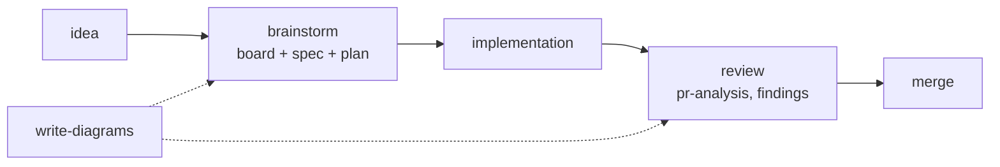
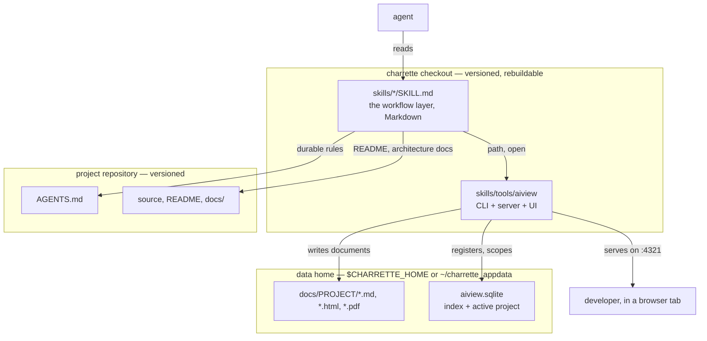
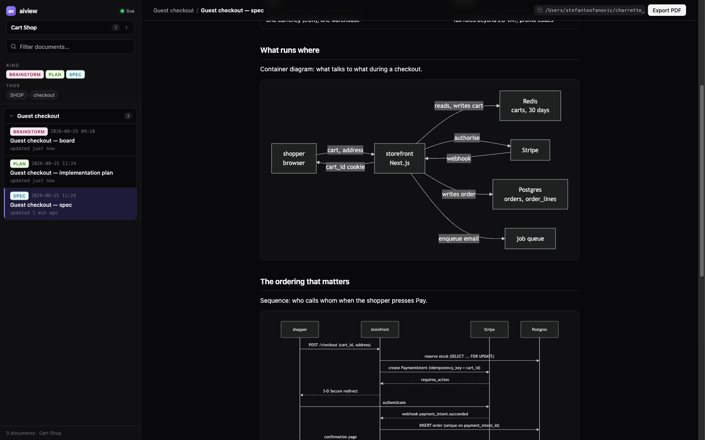

# Charrette

*(French, from architecture studios: the intense working session where a design is
drawn, argued over, and decided before anything expensive is built.)*

**Agent skills for the drawing-board loop: brainstorm → diagram → spec → plan →
review.** Everything is a local document (boards, specs, plans, mockups, PR
analyses) rendered live in the bundled viewer ([aiview](skills/tools/aiview/SKILL.md)),
with diagrams as thinking tools, not decoration.

These documents have two jobs: make it unambiguous between a developer and an agent
what is being built, and be efficient context while it is built. Both end when the PR
merges, so **none of them are versioned and none live in a project repository.** They
are written to a data home outside your repos (`charrette_appdata` in your OS home
directory by default, `$CHARRETTE_HOME` to move it), and
whatever outlives the work is distilled into places that *are* versioned: durable rules
into `AGENTS.md` via [project-conventions](skills/general/project-conventions/SKILL.md), the
story of the change into the PR description. [technical-writing](skills/general/technical-writing/SKILL.md)
is the deliberate exception: a README or an architecture doc is a deliverable, and it
belongs in the repo next to the code it describes.

No lock-in by design: the skills are plain markdown any agent can read, the tooling
is plain Node, references between skills use names plus paths relative to the
referencing file ("in this collection"), and nothing depends on a specific harness, plugin format, or
cloud service.

## The drawing-board loop

The board is a Markdown file opened at the first question and edited through the whole
conversation; chat scrolls away, the board is the record. Charrette has no
implementation skill: the plan is the input to whatever harness you already use.

## Layout

Everything the agent loads lives under `skills/`, grouped by scope. Each skill has
its own folder and starts with a `SKILL.md` that says when and how to use it.
Supporting files (checklists, catalogs, references) sit alongside.

- `skills/general/`: language- and framework-agnostic, for any codebase.
- `skills/react/`: React and frontend work.
- `skills/tools/`: shared local tooling the skills call into (not skills themselves).

Container diagram: what runs where, and which of the three roots each file belongs to.

Nothing crosses those boundaries by accident: the agent writes documents only through
aiview, and reaches a project repository only for the two things meant to outlive the
work.

## Skills

Once a skill is loaded (its `SKILL.md` pointed to, or discovered by name), the ask is
plain language: each skill states when it applies and maps your request onto its flow.
In the order work usually happens:

| Skill | Use case | Example ask |
|---|---|---|
| [brainstorm](skills/general/brainstorm/SKILL.md) | A feature, service, or system is about to be built and the design conversation hasn't happened | *"Run brainstorm: I want per-user rate limiting on the API."* Expect one question at a time, a live board in aiview, and no code until the spec and plan are approved. |
| [write-diagrams](skills/general/write-diagrams/SKILL.md) | A design question would settle faster drawn than argued (the other skills also call it for their documents) | *"Use write-diagrams to draw today's login flow: I need to see where the redirect happens."* |
| [frontend-design](skills/general/frontend-design/SKILL.md) | A screen is about to be built or visually reworked | *"Before we code the settings page, run frontend-design and propose a mockup."* The first run extracts the project's design language; every screen after that is an HTML mockup approved in aiview. |
| [technical-writing](skills/general/technical-writing/SKILL.md) | A system or procedure needs to be understood by a defined reader | *"Use technical-writing for an architecture doc of the payments service, audience: new backend hires."* |
| [project-conventions](skills/general/project-conventions/SKILL.md) | A decision was just made, or a repo's unwritten rules need writing down | *"We just settled on soft deletes everywhere: capture that with project-conventions."* Also: *"Harvest this repo's conventions into AGENTS.md."* |
| [pr-review](skills/general/pr-review/SKILL.md) | A pull request needs an informed merge decision | *"Run pr-review on PR #142."* The analysis lands in aiview: quoted intent, delta map, blast radius, decision points, a ready-to-post comment. |
| [code-design-review](skills/general/code-design-review/SKILL.md) | Program design quality is the question, in any language | *"Code-design-review this branch's diff against main."* |
| [frontend-review](skills/react/frontend-review/SKILL.md) | React/TSX quality is the question | *"Run frontend-review on src/features/checkout."* Findings in chat for a diff; a whole-scope review becomes an aiview report with diagrams. |
| [aiview](skills/tools/aiview/SKILL.md) | Mostly called by the other skills; directly, when a document should be shown or the index queried | *"Open docs/notes/cache-idea.md in aiview, tagged payments."* Also: *"List every document we produced for the payments work."* |

They compose, roughly in the order work happens: `brainstorm` designs
the thing and produces the spec and plan; `frontend-design` turns each screen into an
approved mockup before it's built; `project-conventions` records the decisions as
rules in `AGENTS.md`; `pr-review` maps each change so a human can decide the merge;
`code-design-review` judges the implementation against durable general principles and
`frontend-review` judges the React layer on top. `write-diagrams` and `aiview` are
the shared layer all of them delegate to. House rules win over general principles
wherever the two disagree. That's the point of writing them down.

## The viewer

*A spec for an example project: the board, plan and spec grouped as one piece of work,
diagrams rendered inline.*

aiview is the collection's central tool: one browser tab with full visibility on the
ongoing work. Every document the skills produce registers in its index, documents that
belong to one piece of work share a container, and each save re-renders in the open
tab. You watch decisions, diagrams, and drafts land as they happen.

| Tool | What it does |
|---|---|
| [aiview](skills/tools/aiview/SKILL.md) | Local document viewer + index in one npm package: React/TypeScript/Tailwind UI, small plain-Node server, agent-facing CLI. Renders Markdown (GFM + mermaid), HTML mockups and PDFs at `localhost:4321` with live reload; related documents grouped in collapsible containers; every doc header shows its absolute path (click-to-copy). Documents are filed per project (CIIP, JOBS, …); one active project scopes the sidebar and is shared between you and the agent — either can switch it, and every open tab follows. CLI: `open` (idempotent register + detached server + URL), `add`, `update`, `list`, `remove`, `move`, `project`, `use`, `path` (where a document belongs, joined for your OS), `serve --detach`, `status`, `init`, all with `--json`. Node ≥ 22.5; one-time `npm install && npm run build && node aiview.mjs init` in `skills/tools/aiview/`. Its `SKILL.md` is the contract every skill follows (kinds, tags, groups, start time). |

aiview keeps its index (`aiview.sqlite`), its server files and every document in the
**data home** — `$CHARRETTE_HOME`, or `charrette_appdata` in your OS home directory — never in this
checkout and never in a project repo. The split is deliberate: the checkout holds only
what `npm run build` can recreate, so you can delete it, clone it again, rebuild, and
lose nothing. Documents land in `<home>/docs/<project>/`, and because that folder name
is what aiview reports as the project, the layout labels itself.

## Using the collection

Clone anywhere. Each file is self-contained and resolves its references relative to
itself, so the whole `skills/` tree moves as one. Then point your agent at a skill's
`SKILL.md`, or let it wire the tree into your harness's own skill discovery — which is
the part worth handing over.

You already have the thing that installs this. Fill in where you want the checkout,
paste the rest:

> Set up Charrette. Clone `https://github.com/Ovich/charrette.git` into
> **`<the directory you want it in>`**, build the bundled viewer, and make every skill
> under `skills/` discoverable to you. Then tell me the aiview URL and the skills you
> can reach by name.

Ask it to link rather than copy, and `git pull` in the checkout updates every skill in
place.

## License

MIT: see [LICENSE](LICENSE).
