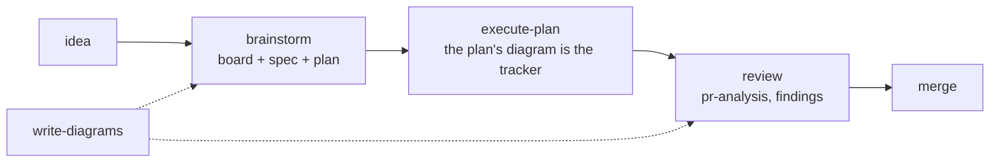

# Charrette

*(French, from architecture studios: the intense working session where a design is
drawn, argued over, and decided before anything expensive is built.)*

**Agent skills for the drawing-board loop: brainstorm → diagram → spec → plan →
execute → review.** Everything is a local document (boards, specs, plans, mockups, PR
analyses) rendered live in the bundled viewer ([aiview](skills/aiview/SKILL.md)),
with diagrams as thinking tools, not decoration.

These documents have two jobs: make it unambiguous between a developer and an agent
what is being built, and be efficient context while it is built. Both end when the PR
merges, so **none of them are versioned and none live in a project repository.** They
are written to a data home outside your repos (`charrette_appdata` in your OS home
directory by default, `$CHARRETTE_HOME` to move it), and
whatever outlives the work is distilled into places that *are* versioned: durable rules
into `AGENTS.md` via [project-conventions](skills/project-conventions/SKILL.md), the
story of the change into the PR description. [technical-writing](skills/technical-writing/SKILL.md)
is the deliberate exception: a README or an architecture doc is a deliverable, and it
belongs in the repo next to the code it describes.

No lock-in by design: the skills are plain markdown any agent can read, the tooling
is plain Node, references between skills use names plus paths relative to the
referencing file ("in this collection"), and nothing depends on a specific harness, plugin format, or
cloud service.

## The drawing-board loop



The board is a Markdown file opened at the first question and edited through the whole
conversation; chat scrolls away, the board is the record. The plan is the same kind of
document for the build: its phasing diagram is the tracker, every step a node with a
status, one node holding the resume state. `execute-plan` runs it without per-step
sign-off and keeps the tracker true, so a session that stops mid-phase leaves a plan
that says exactly where the work stands, and a later session, with none of the
conversation in context, picks it up from there.

## Layout

Everything the agent loads lives under `skills/`, one flat folder per skill, each
starting with a `SKILL.md` that says when and how to use it. Supporting files
(checklists, catalogs, references) sit alongside. Flat because that is what harnesses
discover, and because it makes every cross-reference the same shape: a skill naming
another names it `../<name>/SKILL.md`, always.

Container diagram: what runs where, and which of the three roots each file belongs to.


Nothing crosses those boundaries by accident: the agent writes documents only through
aiview, and reaches a project repository only for the two things meant to outlive the
work.

## Skills

Once a skill is loaded (its `SKILL.md` pointed to, or discovered by name), the ask is
plain language: each skill states when it applies and maps your request onto its flow.
In the order work usually happens:

| Skill | Use case | Example ask |
|---|---|---|
| [brainstorm](skills/brainstorm/SKILL.md) | A feature, service, or system is about to be built and the design conversation hasn't happened | *"Run brainstorm: I want per-user rate limiting on the API."* Expect one question at a time, a live board in aiview, and no code until the spec and plan are approved. The plan comes with its tracker drawn in. |
| [execute-plan](skills/execute-plan/SKILL.md) | An approved plan is ready to be carried out, or was left mid-way by an earlier session | *"Execute the rate-limiting plan."* The plan opens in aiview, the steps run without per-step sign-off, and each node ticks as its done-when is met. Work pauses only at a phase boundary, a decision that is yours, a check that needs your eyes, or an action that does not undo. It refuses a plan with no tracker. |
| [write-diagrams](skills/write-diagrams/SKILL.md) | A design question would settle faster drawn than argued (the other skills also call it for their documents) | *"Use write-diagrams to draw today's login flow: I need to see where the redirect happens."* |
| [frontend-design](skills/frontend-design/SKILL.md) | A screen is about to be built or visually reworked | *"Before we code the settings page, run frontend-design and propose a mockup."* The first run extracts the project's design language; every screen after that is an HTML mockup approved in aiview. |
| [technical-writing](skills/technical-writing/SKILL.md) | A system or procedure needs to be understood by a defined reader | *"Use technical-writing for an architecture doc of the payments service, audience: new backend hires."* |
| [project-conventions](skills/project-conventions/SKILL.md) | A decision was just made, or a repo's unwritten rules need writing down | *"We just settled on soft deletes everywhere: capture that with project-conventions."* Also: *"Harvest this repo's conventions into AGENTS.md."* |
| [pr-review](skills/pr-review/SKILL.md) | A pull request needs an informed merge decision | *"Run pr-review on PR #142."* Reviews in layers: code primitives and code structure always; data model, integration and delivery-and-intent when the diff gives them material. Each layer is its own subagent, and every layer that did not run is recorded with its reason. Two documents land in aiview: the full analysis, and a short report with the abstract, what changed (drawn), what you have to decide, a verdict one line per layer, and a comment you can post as-is if you agree. |
| [code-design-review](skills/code-design-review/SKILL.md) | Program design quality is the question on existing code, in any language | *"Code-design-review the billing module."* DRY, KISS, YAGNI, SOLID, cohesion, coupling. Inside a PR these lenses are already pr-review's; this skill is for code that isn't in one. |
| [frontend-review](skills/frontend-review/SKILL.md) | React/TSX quality is the question | *"Run frontend-review on src/features/checkout."* Findings in chat for a diff; a whole-scope review becomes an aiview report with diagrams. |
| [aiview](skills/aiview/SKILL.md) | Mostly called by the other skills; directly, when a document should be shown or the index queried | *"Open docs/notes/cache-idea.md in aiview, tagged payments."* Also: *"List every document we produced for the payments work."* |

They compose, roughly in the order work happens: `brainstorm` designs
the thing and produces the spec and plan; `execute-plan` runs the plan and keeps its
tracker true; `frontend-design` turns each screen into an approved mockup before it's
built; `project-conventions` records the decisions as rules in `AGENTS.md`; `pr-review`
reads each change at five altitudes so a human can decide the merge;
`code-design-review` judges existing code against durable general principles and
`frontend-review` judges the React layer on top. `write-diagrams` and `aiview` are
the shared layer all of them delegate to. House rules win over general principles
wherever the two disagree. That's the point of writing them down.

## The viewer

aiview is the collection's central tool: one browser tab with full visibility on the
ongoing work. Every document the skills produce registers in its index, documents that
belong to one piece of work share a container, and each save re-renders in the open
tab. You watch decisions, diagrams, and drafts land as they happen.

Both screenshots below are one real piece of work: the redesign of this collection's
own `pr-review` skill into layers, from board to release. The viewer follows the OS
theme; these are dark.

### A spec, with the work it belongs to

What `brainstorm` leaves behind for one feature: the board where the design was
argued, the spec it settled on, and the plan that came out of it, grouped as one
container in the sidebar. The spec's diagrams render inline, here the five layers as a
table and the orchestrator that dispatches them, so a boundary is checked drawn, not
described. The header shows the document's absolute path, click to copy.


### The same plan, mid-execution

The plan's phasing diagram is the tracker: every step a node carrying its status and,
once done, what it found. Here the trial and the fixes it produced are ✅ with their
evidence written in, the gate asks whether the trials were clean, the branch taken
leads to the one ▶ step, the release in progress with its done-when, and the branch not
taken is ✖ with the reason, never deleted. Above the flow, out of frame, a state node
connected to nothing holds branch and commit, what is deployed where, the next step,
what is blocked and what is parked. That node is what makes the plan resumable: a
session that ends here loses nothing, and one that picks the plan up a week later, with
none of the conversation in context, reads the state node and continues.

`execute-plan` is what keeps this true while the work happens: a node turns ✅ only
when its own done-when is met and the evidence goes into the step, the tracker is
updated before every handoff, deviations are drawn before they are done, and the state
node is overwritten, never appended to.


### Mockups that compose

The viewer is where you and the agent agree on what will be built: the design is
discussed there, the spec and the plan are written there, and a screen is drawn there
before it is coded. A mockup is that agreement for one screen. You look, you say what
you want changed, the agent changes it.

A component is drawn once, in one mockup, and every other mockup of the project uses
that drawing. When the agent changes it, every screen that uses it reloads with the
change, so what was agreed on one screen holds on all of them.

The demo is a shop: a parts sheet with the cart line, the stepper, the promo field, the
checkout button, the badge and the empty state, and a cart page that uses them eleven
times.


A screen has variants: empty, a promo applied, an item out of stock. They sit in the
toolbar above the frame. The one you choose stays through every change the agent makes.

The **Composition** view shows where the screen comes from: what it takes from other
mockups, outlined in indigo, and what it offers to them, in green. A click on an
outlined region opens the mockup it comes from.


The parts sheet in the same view, each offered component outlined:


The agent reads the same facts from the command line, without a browser, and follows
[frontend-design](skills/frontend-design/SKILL.md) when it draws: the design language is
extracted once, every screen is a mockup approved in the viewer, and code comes after.

| Tool | What it does |
|---|---|
| [aiview](skills/aiview/SKILL.md) | The viewer and its index, one npm package, Node and nothing else. It renders Markdown with mermaid, HTML mockups and PDFs at `localhost:4321`, reloads on save, groups the documents of one piece of work, and files everything per project. The agent drives it from the CLI: `open` a document, `list`, `update`, `move`, `path` to ask where one belongs, `components` and `check` for mockups, `pending` for work still running, every verb with `--json`. Its `SKILL.md` is the contract the other skills follow. |

aiview keeps its index (`aiview.sqlite`), its server files and every document in the
**data home** — `$CHARRETTE_HOME`, or `charrette_appdata` in your OS home directory — never in this
checkout and never in a project repo. The split is deliberate: the checkout holds nothing
you cannot get back from git, so you can delete it, clone it again, and lose nothing. Documents land in `<home>/docs/<project>/`, and because that folder name
is what aiview reports as the project, the layout labels itself.

## Using the collection

Prompt for your agent:

> Set up Charrette: clone `https://github.com/Ovich/charrette.git` into
> `<the checkout>`, build the bundled viewer, and make every skill under `skills/`
> discoverable to you (symlink or otherwise). Then tell me the aiview URL and the
> skills you can reach by name.

On Claude Code you can install it as a plugin instead. The skills then answer to
`charrette:` — `/charrette:pr-review`, `/charrette:brainstorm` — so nothing collides
with skills you already have:

```
/plugin marketplace add Ovich/charrette
/plugin install charrette@charrette
```

## Updating

A checkout takes a prompt, because three things move and only one of them is `git pull`:

> Update Charrette in `<the checkout>`: pull, restart the viewer's server if one is
> running, and repair skill discovery — links made against the old `skills/general/…`
> paths are dangling since the layout flattened. Leave the data home alone. Then tell me
> the aiview URL and the skills you can reach by name.

The viewer's build output arrives with the pull, but a running server keeps serving the
copy it started with until it restarts. Skills are linked rather than copied, so they
update with the pull; links made before the layout flattened point at directories that
no longer exist.

The plugin takes three steps, and the third is not optional — an update is only applied
to a session that starts after it:

```
/plugin marketplace update charrette
/plugin update charrette@charrette
```

Then restart Claude Code. `/plugin marketplace update` alone refreshes the catalogue
without touching the installed copy, which is why both commands are here.

## License

MIT: see [LICENSE](LICENSE).
