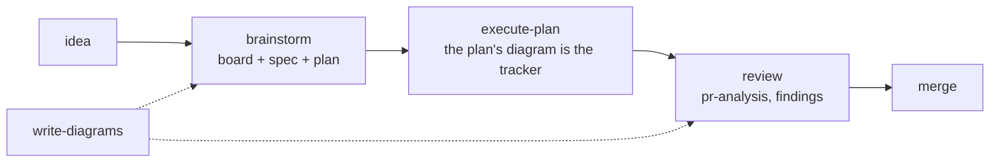
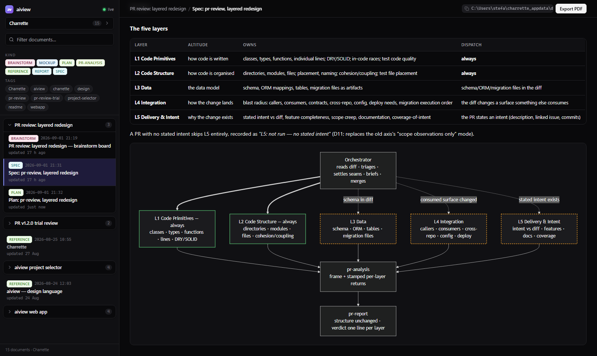
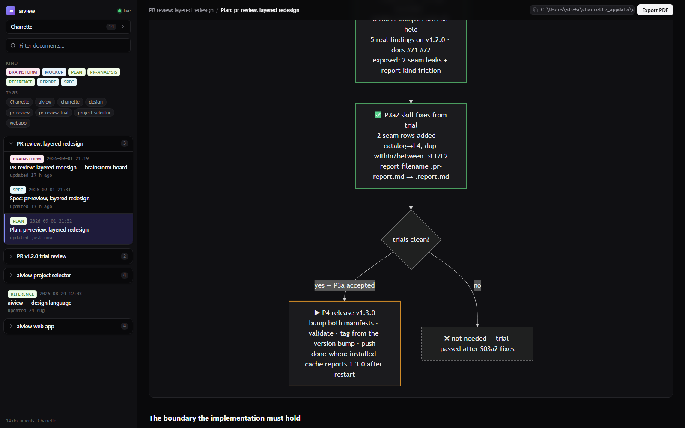
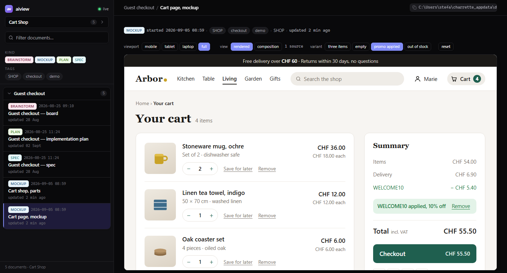
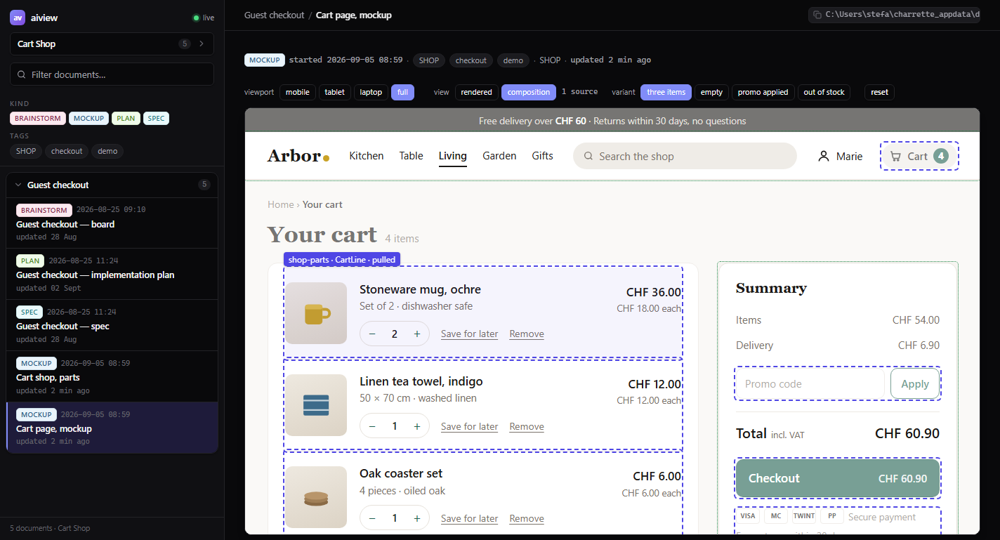
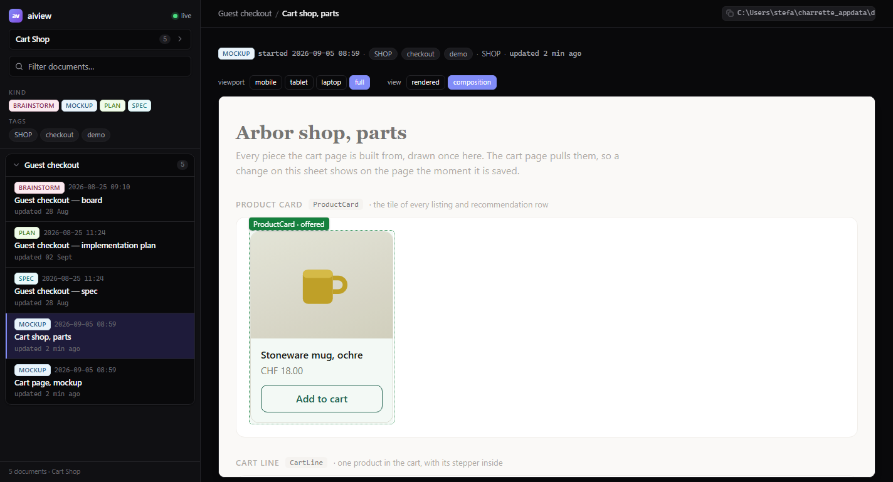

# Charrette

*(French, from architecture studios: the intense working session where a design is
drawn, argued over, and decided before anything expensive is built.)*

Agent skills that settle what gets built before code is written. They sharpen the engineer's thinking rather than replace it: every design, plan and screen is drawn, argued and approved by a person before an agent acts on it. A design conversation ends in a spec and a plan, a screen in a working mockup, a pull request in an analysis with the decisions only a human can make. Every document renders live in aiview, the companion app. None of it lands in your repository.

Diagrams are one of software engineering's most useful techniques, and they went nearly extinct because of their cost. Charrette brings them back into the AI era. A diagram states a concept in a form both a person and an agent read the same way, so the design lives in one shared picture rather than in two understandings of the same prose, and it is the densest context an agent can be given about a system.

Nine skills in plain Markdown and a companion app in plain Node. No harness, plugin format or cloud service is required.

## The loop



The board is a Markdown file opened at the first question and edited through the whole conversation. The plan is the same kind of document for the build: its phasing diagram is the tracker, and a later session with none of the conversation in context resumes from it.

## What it looks like

The first two are from one real piece of work: the redesign of this collection's own `pr-review` skill into layers. The viewer follows the OS theme.

### A spec, with the work it belongs to

What `brainstorm` leaves behind for one feature: the board, the spec and the plan, grouped in the sidebar. The spec's diagrams render inline, here the five layers and the orchestrator that dispatches them. The header shows the absolute path, click to copy.



### The same plan, mid-execution

The plan's phasing diagram is its tracker: one node per step with a status glyph, gates that record the branch taken, and a state node with branch, commit, next step, blocked and parked, which is what a later session resumes from.



### Mockups that work

A mockup is a working prototype, not a picture: a stepper counts, a promo code applies, a questionnaire advances, the behaviour mocked in the file. Describe the flow, not only the screen, and every state, transition and edge case is settled before implementation. The demo below is a shop's cart page.



A screen has states: empty, promo applied, an item out of stock. The mockup declares them as variants, the viewer exposes them in its toolbar, and the chosen one persists across reloads.

### Mockups that compose

A component is drawn once and bound by every screen that needs it. The cart page binds the cart line, the stepper, the promo field, the checkout button, the badge and the empty state from a parts sheet, eleven bindings in all. `aiview check` says whether they resolve. The Composition view outlines what a screen binds, in indigo, and what it exposes, in green. A click on a bound region opens its source.



The parts sheet in the same view, one outline per exposed component:



## Install

**Claude Code**, as a plugin. The skills answer to `charrette:`, as `/charrette:brainstorm` or `/charrette:pr-review`, so nothing collides with skills you already have:

```
/plugin marketplace add Ovich/charrette
/plugin install charrette@charrette
```

**Any other agent**, from a clone. Node 22.5 or later, nothing else. Prompt:

> Set up Charrette: clone `https://github.com/Ovich/charrette.git` into
> `<the checkout>`, build the bundled viewer, and make every skill under `skills/`
> discoverable to you (symlink or otherwise). Then tell me the aiview URL and the
> skills you can reach by name.

Then ask in plain language. Each skill states when it applies and maps your request onto its flow.

## Skills

In the order work usually happens:

| Skill | Use case | Example ask |
|---|---|---|
| [brainstorm](skills/brainstorm/SKILL.md) | Something non-trivial is about to be built and the design conversation hasn't happened | *"Run brainstorm: I want per-user rate limiting on the API."* One question at a time, no code until the spec and plan are approved. |
| [execute-plan](skills/execute-plan/SKILL.md) | An approved plan is ready, or was left mid-way by an earlier session | *"Execute the rate-limiting plan."* Pauses only for your decisions, your checks, or an action that does not undo. Refuses a plan with no tracker. |
| [write-diagrams](skills/write-diagrams/SKILL.md) | A design question would settle faster drawn than argued | *"Draw today's login flow: I need to see where the redirect happens."* |
| [frontend-design](skills/frontend-design/SKILL.md) | A screen is about to be built or visually reworked | *"Before we code the settings page, propose a mockup."* Design language extracted once, every screen approved in the viewer, code after. |
| [technical-writing](skills/technical-writing/SKILL.md) | A document that stays in the repository: a README, an architecture doc, an ADR, a runbook | *"Write an architecture doc of the payments service, audience: new backend hires."* |
| [project-conventions](skills/project-conventions/SKILL.md) | A decision was just made, or a repo's unwritten rules need writing down | *"We just settled on soft deletes everywhere: capture that."* Or: *"Harvest this repo's conventions into AGENTS.md."* |
| [pr-review](skills/pr-review/SKILL.md) | A pull request needs an informed merge decision | *"Run pr-review on PR #142."* Five layers, each its own subagent, dispatched where the diff gives them material. Two documents: the analysis, and a report with what changed (drawn), a verdict per layer, what you must decide, and a comment to post as-is. |
| [code-design-review](skills/code-design-review/SKILL.md) | Design quality on code that is not in a PR, any language | *"Code-design-review the billing module."* DRY, KISS, YAGNI, SOLID, cohesion, coupling. Inside a PR these lenses are pr-review's. |
| [frontend-review](skills/frontend-review/SKILL.md) | React/TSX quality | *"Run frontend-review on src/features/checkout."* Findings in chat for a diff, an aiview report for a whole scope. |
| [aiview](skills/aiview/SKILL.md) | The companion app: a viewer at `localhost:4321` and an index, driven by the agent from a CLI. Called by the other skills; directly, to show a document or query the index | *"Open docs/notes/cache-idea.md in aiview, tagged payments."* |

`write-diagrams` and the companion app are the shared layer the others delegate to. House rules in `AGENTS.md` win over general principles wherever the two disagree.

## Where things live

| Root | Holds | Versioned |
|---|---|---|
| The checkout, or the plugin cache | `skills/<name>/SKILL.md`, one flat folder per skill, supporting files alongside. `skills/aiview/`: CLI, server and UI | Yes, rebuildable |
| The data home, `$CHARRETTE_HOME` or `charrette_appdata` in your OS home directory | `docs/<project>/*.md, *.html, *.pdf`, and `aiview.sqlite`, the index and the active project | Never in a project repo. May be its own git repo, to sync between machines |
| Your project repository | `AGENTS.md`, grown by project-conventions. README and architecture docs, written by technical-writing | Yes, by you |

Boards, specs, plans, mockups and PR analyses are obsolete when the PR merges, so by default none are versioned and none live in a project repository. The index only points at files: a document you want in a repo can live there, and aiview serves it from where it is. The agent reaches a project repository only for the two things meant to outlive the work.


## Updating

The plugin takes three steps. The third is not optional: an update applies only to a session started after it.

```
/plugin marketplace update charrette
/plugin update charrette@charrette
```

Then restart Claude Code. `/plugin marketplace update` alone refreshes the catalogue without touching the installed copy.

A checkout takes a prompt, because three things move and only one is `git pull`:

> Update Charrette in `<the checkout>`: pull, restart the viewer's server if one is
> running, and repair skill discovery: links made against the old `skills/general/…`
> paths are dangling since the layout flattened. Leave the data home alone. Then tell me
> the aiview URL and the skills you can reach by name.

A running server keeps serving the copy it started with. Skills are linked, not copied, so they update with the pull, but links made before the layout flattened dangle.

## License

MIT: see [LICENSE](LICENSE). One reference of the frontend-design skill adapts material from Anthropic's skills repository under the Apache License 2.0. Its notice is in that file and the licence in `licenses/`.
