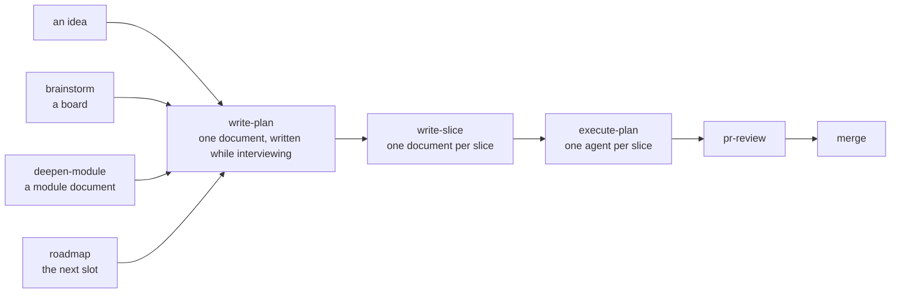

# Charrette

[](RELEASING.md)
[](https://github.com/Ovich/charrette/stargazers)
[](https://github.com/Ovich/charrette/commits/main)
[](LICENSE)

*(French, from architecture studios: the intense working session where a design is
drawn, argued over, and decided before anything expensive is built.)*

Agent skills that settle what gets built before code is written. They sharpen the engineer's thinking rather than replace it: every design, plan and screen is drawn, argued and approved by a person before an agent acts on it. A design conversation ends in one plan, a screen in a working mockup, a pull request in an analysis with the decisions only a human can make. Every document renders live in aiview, the companion app. None of it lands in your repository.

Diagrams are one of software engineering's most useful techniques, and they went nearly extinct because of their cost. Charrette brings them back into the AI era. A diagram states a concept in a form both a person and an agent read the same way, so the design lives in one shared picture rather than in two understandings of the same prose, and it is the densest context an agent can be given about a system.

Eighteen skills in plain Markdown and a companion app in plain Node. No harness, plugin format or cloud service is required.

## The loop

Phasing: what a piece of work passes through, from its entry points to merge.



A plan starts from whatever exists: an idea said in chat, a board, an agreed module, the roadmap's next slot. `interview` resolves the decisions along the way and `write-diagrams` draws them. The plan's diagram is the tracker, and a later session with none of the conversation in context resumes from it.

## Iterate the loop

Charrette is run iteratively. One pass of the loop is one iteration: it plans and builds a single increment, a feature or a bounded change that works and can be verified when the iteration ends. The plan is the iteration's plan, not the project's: it covers the increment and stops where the next one would begin, think of an agile approach. What the increment teaches feeds the next plan, so the design grows by increments and each plan is written with the last increment's learning in hand.

The thing to avoid is big design up front: an agent loves writing plans, embellished and polished, and they can fall apart at the end. A plan is sized to what a person can hold in mind, understand and approve in one reading.

Above the iterations sits the roadmap, one document per project kept by the `roadmap` skill: the iterations in order, each made of slots, a slot being something the customer can use or a system that can be deployed. Each slot points at the boards, mockups and plans that exist for it, its state derived from them, and the foundation reference beside it records the technology decisions, closed no later than the first slot that needs them. Only the next iteration is drawn precisely: a slot is split when the work reaches it, and the roadmap is redrawn when a slot lands.

## What it looks like

The first two are from one real piece of work: the redesign of this collection's own `pr-review` skill into layers. The viewer follows the OS theme.

### A spec, with the work it belongs to

What `brainstorm` and `write-plan` leave behind for one feature: the board and the spec in one group, the plan with its slice documents in another. The spec's diagrams render inline, here the five layers and the orchestrator that dispatches them. The header shows the absolute path, click to copy.


### The same plan, mid-execution

The plan's phasing diagram is its tracker: one node per step, saying in three lines what the step delivers and what made the orchestrator go on, pause or drop it, gates that record the branch taken, a state node with branch, commit, next step, blocked and parked, which is what a later session resumes from, and under the diagram the mandate in force, in one line.


### Mockups that work

A screen is judged by human eyes, so the person stays in the loop for it. In the near future the main user of software will probably be an agent; until then there is a person at the screen, and the mockup is where they look before anything is built.

A mockup is a working prototype, not a picture: a stepper counts, a promo code applies, a questionnaire advances, the behaviour mocked in the file. Describe the flow, not only the screen, and every state, transition and edge case is settled before implementation. The demo below is a shop's cart page.


A screen has states: empty, promo applied, an item out of stock. The mockup declares them as variants, the viewer exposes them in its toolbar, and the chosen one persists across reloads.

### Mockups that compose

A component is drawn once and bound by every screen that needs it. The cart page binds the cart line, the stepper, the promo field, the checkout button, the badge and the empty state from a parts sheet, eleven bindings in all. `aiview check` says whether they resolve. The Composition view outlines what a screen binds, in indigo, and what it exposes, in green. A click on a bound region opens its source.


The parts sheet in the same view, one outline per exposed component:


## Install

**Claude Code**, as a plugin. The skills answer to `charrette:`, as `/charrette:brainstorm` or `/charrette:pr-review`, so nothing collides with skills you already have:

```
/plugin marketplace add Ovich/charrette
/plugin install charrette@charrette
```

**Any other agent**, from a clone. Node 22.5 or later, nothing else. Prompt:

> Set up Charrette: clone `https://github.com/Ovich/charrette.git` into
> `<the checkout>`, build the bundled viewer, and make every skill under `skills/`
> discoverable to you (symlink or otherwise). Then tell me the aiview URL and the
> skills you can reach by name.

Then ask in plain language. Each skill states when it applies and maps your request onto its flow.

## Skills

In the order work usually happens:

| Skill | Use case | Example ask |
|---|---|---|
| [roadmap](skills/roadmap/SKILL.md) | A project has to be declared above its pieces of work, from nothing or from the boards and mockups already made, or a slot has landed and the picture must be redrawn | *"Declare the roadmap for this project."* Everything that exists read first, the missing slots named (accounts, the repository, the foundation), iterations of deliverable slots drafted with a recommendation in every open place, then an interview on the draft. The foundation reference beside it holds the stack, the database, the API, the hosting, each row closed no later than the first slot that needs it. |
| [brainstorm](skills/brainstorm/SKILL.md) | An idea is worth thinking through and keeping, before a plan or without one | *"Run brainstorm: should we move the agent onto LangGraph?"* The interview, kept on a live board with its diagrams and what was investigated. A plan can start from it and does not need it. |
| [interview](skills/interview/SKILL.md) | A design object has decisions nobody has resolved, or you want to be questioned about one until it is understood the same way | *"Interview me about this plan."* Decisions walked in dependency order, the codebase read before you are asked, a recommendation on every question. Every claim about a tool or a practice is researched from its sources; very small proofs of concept with the libraries, when you say yes to them. |
| [write-plan](skills/write-plan/SKILL.md) | Something non-trivial is about to be built and its plan has to be written | *"Write the plan for per-user rate limiting."* One document, written while interviewing: why, before and after, the deep modules, the flows, the failure modes, the suite, the slices with their tracker, and the mandate you give the orchestrator. No code until it is approved. |
| [deepen-module](skills/deepen-module/SKILL.md) | A module's interface has to be designed or reworked so that it hides much behind little | *"Deepen the agent module."* The code a caller writes to use it, the one entry as signatures, what stays outside, the gap from today, discussed until agreed. write-plan shapes its major areas this way. |
| [write-slice](skills/write-slice/SKILL.md) | A plan's increment has to be cut into slices, or a slice of an approved plan needs the document an agent will carry it out from | *"Write the slice document for SL3."* One plan node in, its document out: the decisions quoted, the modules table its tests are written against, the environment facts the first command trips on. |
| [execute-plan](skills/execute-plan/SKILL.md) | An approved plan is ready, or was left mid-way by an earlier session | *"Execute the rate-limiting plan."* Delegates each slice to a fresh agent, keeps the tracker, merges. Pauses only for your decisions, your checks, or an action that does not undo. Refuses a plan with no tracker. |
| [execute-slice](skills/execute-slice/SKILL.md) | One slice document is handed to an agent to carry out | *"Do slice 2."* Checks the blockers first and stops if any is unmet, writes the code and the tests as the document's Tests section says, which carries the mandate's answer in full: at the plan end in a last test slice (the fast lane, recommended), at the slice end, commit only at green, or commit per phase, returns the branch and the run as evidence. |
| [verification-skill-create](skills/verification-skill-create/SKILL.md) | A project's user stories should be shown to work end to end, through the interface their consumer uses, and it has no verification skill yet | *"Create the verification skill for this app."* The consumer, the interface and the harness read from the repository, a project-local `verify-<app>` skill written, the feature map drawn in aiview, one story proven. execute-plan offers it when a plan starts. |
| [verification-skill-maintain](skills/verification-skill-maintain/SKILL.md) | The application changed and its verify skill or feature map must follow, from a slice, a commit range or a date | *"Maintain the verification skill since the last slice."* Only what the diff moved is changed, the affected stories re-proven. execute-plan runs it once, at the slot's end. |
| [write-diagrams](skills/write-diagrams/SKILL.md) | A design question would settle faster drawn than argued | *"Draw today's login flow: I need to see where the redirect happens."* |
| [frontend-design](skills/frontend-design/SKILL.md) | A screen is about to be built or visually reworked | *"Before we code the settings page, propose a mockup."* Design language extracted once, every screen approved in the viewer, code after. |
| [point-at](skills/point-at/SKILL.md) | The agent is about to ask you about a screen, or you do not see what it means | *"Show me what you mean."* Finds the screen's mockup, asks in the mockup's own component names, and points your open viewer at them: the tab moves there, the components are outlined and named, the rest dimmed. Called by the skills that ask questions. |
| [technical-writing](skills/technical-writing/SKILL.md) | A document that stays in the repository: a README, an architecture doc, an ADR, a runbook | *"Write an architecture doc of the payments service, audience: new backend hires."* |
| [project-conventions](skills/project-conventions/SKILL.md) | A decision was just made, or a repo's unwritten rules need writing down | *"We just settled on soft deletes everywhere: capture that."* Or: *"Harvest this repo's conventions into AGENTS.md."* |
| [pr-review](skills/pr-review/SKILL.md) | A pull request needs an informed merge decision | *"Run pr-review on PR #142."* Five layers, each its own subagent, dispatched where the diff gives them material. Two documents: the analysis, and a report with what changed (drawn), a verdict per layer, what you must decide, and a comment to post as-is. |
| [eliminate-findings](skills/eliminate-findings/SKILL.md) | The same remark keeps coming back in the pull request reviews | *"What do my reviews keep catching, and how do we stop catching it?"* The comment history read, grouped into findings by the person's words, each tried against a ladder: impossible by design, a lint or type rule, a test in CI, a convention, a sentence in the skill that produced the code. A report with the artefact drafted per finding, applied on a yes. |
| [code-design-review](skills/code-design-review/SKILL.md) | Design quality on code that is not in a PR, any language | *"Code-design-review the billing module."* DRY, KISS, YAGNI, SOLID, cohesion, coupling. Inside a PR these lenses are pr-review's. |
| [frontend-review](skills/frontend-review/SKILL.md) | React/TSX quality | *"Run frontend-review on src/features/checkout."* Findings in chat for a diff, an aiview report for a whole scope. |
| [aiview](skills/aiview/SKILL.md) | The companion app: a viewer at `localhost:4321` and an index, driven by the agent from a CLI. Called by the other skills; directly, to show a document or query the index | *"Open docs/notes/cache-idea.md in aiview, tagged payments."* |

`write-diagrams`, `interview`, the tracker protocol in `execute-plan` and the companion app are the shared layer the others delegate to. `roadmap` sits above the loop: it names the next slot, and a board, a plan or a run finishing tells it to redraw. House rules in `AGENTS.md` win over general principles wherever the two disagree.

## Where things live

| Root | Holds | Versioned |
|---|---|---|
| The checkout, or the plugin cache | `skills/<name>/SKILL.md`, one flat folder per skill, supporting files alongside. `skills/aiview/`: CLI, server and UI | Yes, rebuildable |
| The data home, `$CHARRETTE_HOME` or `charrette_appdata` in your OS home directory | `docs/<project>/*.md, *.html, *.pdf`, among them the project's roadmap and its foundation reference, and `aiview.sqlite`, the index and the active project | Never in a project repo. May be its own git repo, to sync between machines |
| Your project repository | `AGENTS.md`, grown by project-conventions. README and architecture docs, written by technical-writing | Yes, by you |

Charrette stores its documents outside the repository to avoid doc rot: outdated documents influence the agent badly. Boards, plans, mockups and PR analyses are obsolete when the PR merges, so by default none is versioned and none lives in a project repository. For some types of documents, an architecture doc, an ADR, a spec the team keeps current, the codebase can be considered, and it is allowed: the index only points at files, and aiview serves a document from where it is.


## Updating

The plugin takes three steps. The third is not optional: an update applies only to a session started after it.

```
/plugin marketplace update charrette
/plugin update charrette@charrette
```

Then restart Claude Code. `/plugin marketplace update` alone refreshes the catalogue without touching the installed copy.

A checkout takes a prompt, because three things move and only one is `git pull`:

> Update Charrette in `<the checkout>`: pull, restart the viewer's server if one is
> running, and repair skill discovery: links made against the old `skills/general/…`
> paths are dangling since the layout flattened. Leave the data home alone. Then tell me
> the aiview URL and the skills you can reach by name.

A running server keeps serving the copy it started with. Skills are linked, not copied, so they update with the pull, but links made before the layout flattened dangle.

## License

MIT: see [LICENSE](LICENSE). One reference of the frontend-design skill adapts material from Anthropic's skills repository under the Apache License 2.0. Its notice is in that file and the licence in `licenses/`.
