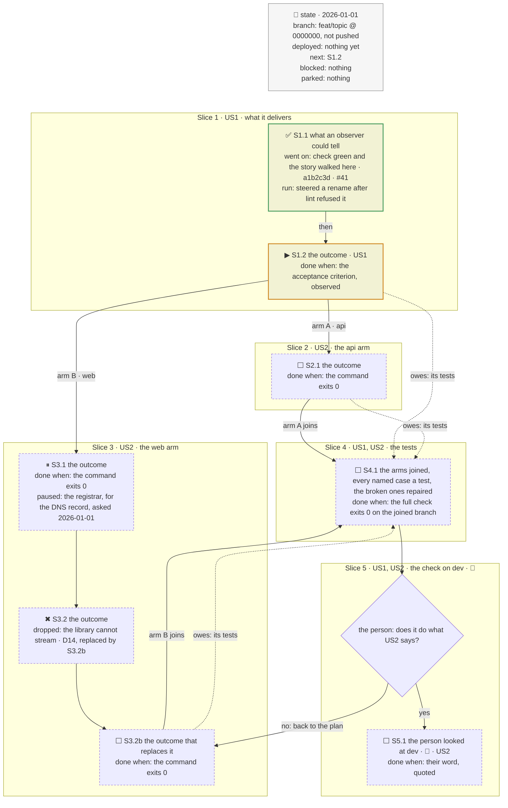

# The tracker's skeleton

Copy the block, replace every phrase, delete what the plan has no use for. Keep the caption
line above the fence and the mandate line under it. Under a `tests:` other than *at the
plan end*, delete the test slice and the dotted edges that owe it.

Phasing diagram: the slices, the fork, and what each step has to show before the next begins.

mandate: run through · one for the plan · delegated · opus · tests at the plan end · verify off
