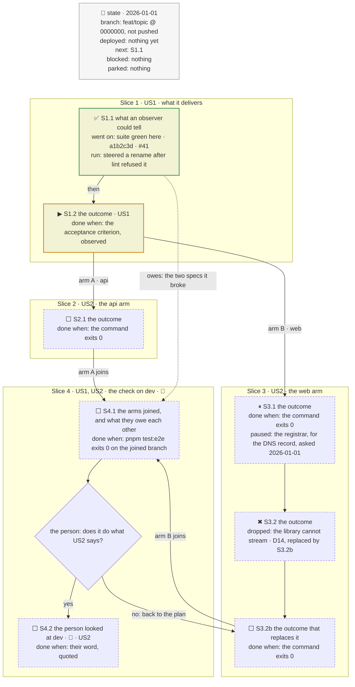

# The tracker's skeleton

Copy the block, replace every phrase, delete what the plan has no use for. The caption
line above the fence stays: `aiview mermaid-check` warns without one.

Phasing diagram: the slices, the fork, and what each step has to show before the next begins.

