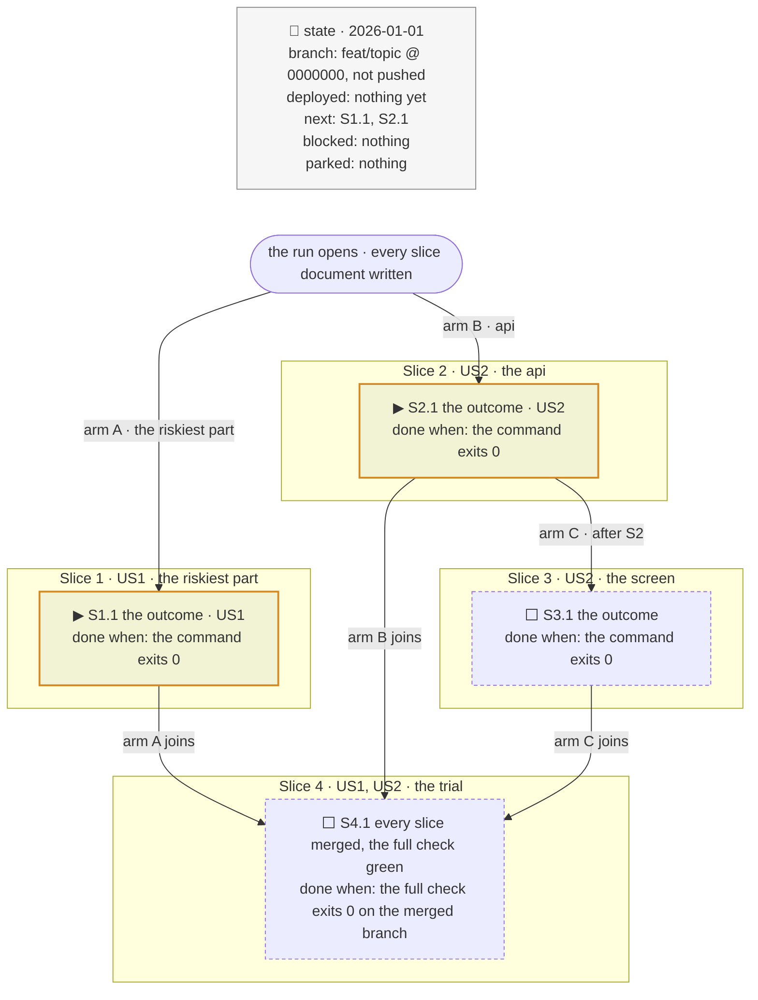

# A plan in swarm mode

Read when the mode is `swarm`. Everything else in this skill holds; this changes the cut, the
tracker and the order the documents are written in.

## The cut

- **No fork proof.** Slices may share a file: their runners settle it on the board (the `swarm`
  skill). Cut thin and vertical as the `write-slice` skill's `references/cutting.md` says; its
  fork rule and the disjoint arms of `references/tracker.md` do not apply.
- **Three phases, no chains.** An optional ground slice first, only when the others need its
  merged result (a shared contract, a move, a rename); then every other slice at once, settling
  what they share on the board; then the test slice. No slice waits on another between the ground
  slice and the tests: a dependency short of the ground is settled on the board, never drawn as a
  blocker.
- **The riskiest unknown is still Slice 1**, so its runner meets it first and the others hear of
  it on the thread.
- **Every slice document is written before the run**, with the `write-slice` skill, the test
  slice of `tests: at the plan end` excepted. The orchestrator dispatches them all at once.

## The tracker

**The slices are arms of one start node, joined at the trial**: the step whose done-when is the
full check on the branch every slice merged into.

- **One arm per slice, labelled with its area.** A slice with a blocker hangs from its blocker's
  last step, its label naming it (`after S2`), never from the start.
- **One ▶ per arm**: every running slice shows it at once.

## The mandate

**`mode: swarm` is the first field**, in the *Mandate* section and first in the line under the
tracker: `mandate: mode swarm · run through · …`. The other fields are asked as for any plan.
