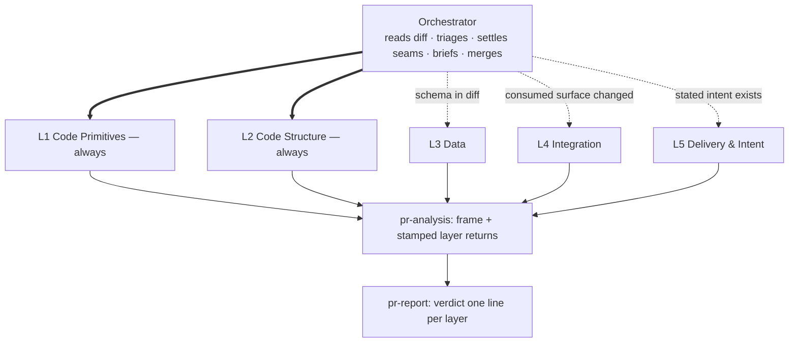

# PR review

A reviewer's real job is a set of decisions: merge or not, which risks to accept,
which questions to send back. Most review tools emit findings and leave the deciding
context in the reviewer's head. This skill produces the context: a **PR analysis
document** that describes the change, draws how the structure moved, names the blast
radius, and lists the decision points, then attaches findings, each citing its
source. It reviews in **layers**: independent subagents, each reading the change at
one altitude, dispatched only where the diff gives them material. Stack-agnostic: it
reads diffs and repo docs, not framework knowledge.

## Scope (explicit, refused when broken)

- `/pr-review <PR#>` → `gh pr diff` / `gh pr view` (description, linked issues, comments).
- `/pr-review <branch|ref>` → three-dot diff from the merge-base: `git diff <ref>...HEAD`.
- `/pr-review` with neither → ask for the fixed point rather than guessing.

Check the ref resolves and the diff is non-empty **before** doing anything else.
Three-dot from the merge-base means uncommitted work is invisible: say so if the
working tree is dirty. Skip vendored, generated, build, and lockfile paths.

**Resolve the diff and the search base to the same revision.** Reviewing by PR number
needs no checkout, so the working tree stays on whatever branch it was on, and every
integration search then runs against code that does not contain the PR: cited
`file:line`, confidently wrong. Check out the PR's head, or say plainly that the blast
radius was not repo-verified.

**Then read the repo's own conventions, before anything is dispatched**: `AGENTS.md`,
`CLAUDE.md`, architecture docs, and `project-conventions`
(`../project-conventions/SKILL.md` in this collection) where its rules apply. This is
what the stack-agnostic claim rests on. It separates *violates a house rule* (a
finding) from *unusual but unruled* (a decision point), and it is usually how you
learn that a consumer of this change lives in another repository entirely.

## The five layers

Each layer reads the change at one altitude. Two always run; three run when the diff
gives them material. **The diff decides — there is no opt-in question to the human**,
and every layer that does not run is recorded, with its reason, in the analysis and
in the verdict. A reader takes silence for coverage; a recorded skip is the
difference between *not checked* and *checked and clean*.

| Layer | Altitude | Owns | Dispatched when |
|---|---|---|---|
| **L1 Code Primitives** | how code is written | classes, types, functions, individual lines; DRY and SOLID; races visible in a function body; test code quality | **always** |
| **L2 Code Structure** | how code is organised | directories, modules, files; placement and naming; cohesion and coupling; test file placement | **always** |
| **L3 Data** | the data model | schema, ORM mappings, tables, migration files as artifacts | schema, ORM or migration files are in the diff |
| **L4 Integration** | how the change lands | blast radius: callers, consumers, contracts, other repos, config, deploy needs, migration execution order | the diff changes a surface something else consumes |
| **L5 Delivery & Intent** | why the change exists | stated intent vs the diff, feature completeness, scope creep, documentation, coverage of the stated behaviour | the PR states an intent — description, linked issue, commit messages |

A PR with no stated intent skips L5 entirely: *"L5: not run — no stated intent."*
Never infer an intent so the layer has something to check against; the layer would
then be checking the code against itself.

The design lenses live here, not in a chained skill: DRY and SOLID are L1's, cohesion
and coupling are L2's. This skill **no longer chains `code-design-review`** — its
ground is covered by the always-on layers. The standalone skill remains for reviewing
existing code outside a PR.

Cost follows the diff: the floor is two agents, the ceiling five, a typical review
three or four. No layer is bought by a human; none is skipped silently.

## Jurisdiction: who owns a question

Two agents that cannot see each other, given the same question, both answer it in
full. The cost is not one duplicated file read: it is one agent's entire
investigation run twice. So jurisdiction is settled **before** dispatch, by one rule
and one table, and **no two agents in a review ever hold the same question** — that
holds between layers and inside one, if a layer is ever split.

**The altitude rule.** A layer owns the questions answerable at its altitude without
descending. L2 never reads function bodies; L1 never reasons about deployment; L3
reads the model, not the code that queries it.

**The seam table** — the known cases where altitudes touch:

| Seam | Owner | Why |
|---|---|---|
| Function in the wrong module | L2 | Placement is organisation |
| Type mirroring a DB column | L3 | The schema is the truth |
| Consumers in another repo | L4 | Blast radius owns reach |
| Race inside a function body | L1 | Visible at line altitude |
| Migration deploy/execution order | L4 | A deploy question, not a model question |
| Coverage of the stated behaviour | L5 | An intent question |
| README, catalogs, discovery surfaces | L4 | They are consumed surfaces; L5 checks claims against the code, not the catalog |
| Duplicated content within one file / between files | L1 / L2 | Same evidence, two altitudes — split it before both agents find it |
| Test code quality / test placement | L1 / L2 | Tests are just code at those altitudes |
| Big file: real change or churn? | You, before dispatch | Established once, handed to every brief as fact |

A seam the table does not list is yours to assign before dispatch, and the winning
brief says it was assigned. A defect that genuinely spans altitudes — a transaction
bug touching code, model and deploy — comes back as facets, one per layer, and joins
into one finding at merge, citing every contributing return.

## Two documents, two readers

A review produces two files, in the data home (ask the `aiview` skill for the path;
never in the repo under review), both registered through the `aiview` skill
(`../aiview/SKILL.md` in this collection) and both joined to the **same
group** (`pr-<id>`), so they sit together in the sidebar. Each links the other.

| | `YYYY-MM-DD-pr-<id>.report.md` | `YYYY-MM-DD-pr-<id>.pr-analysis.md` |
|---|---|---|
| Reader | the human deciding whether to merge | the next agent — and the human asking *"why does it say that?"* |
| Life | read once, now | consulted on demand, and by whoever picks this up later |
| Size | fits on one screen before the comment block | as long as the evidence needs |
| Holds | the conclusions | what earns them |

**The report makes claims; the analysis holds the evidence.** Every claim in the report
traces to a section of the analysis, and nothing appears in the report the analysis does
not support — the same rule the proposed comment already obeys toward its own document,
applied one level up. Tell the user the **report's** URL; they reach the analysis from
the group, or from the link.

Write both from the start. The report's Abstract, What changed and diagram are
knowable before any layer returns, so publish them immediately and carry one
`aiview pending` card per dispatched layer on the report — that is the document the
developer has open while they wait. The cards sit above the content and vanish as each
layer lands, replaced by the section it produced.

**Stamp what an agent produced.** A section written from a subagent's return carries a
one-line attribution under its heading, naming the layer and what you did to its output
before believing it:

> *From L4 Integration. Merged, deduplicated, and every citation re-read before
> inclusion.*

Two reasons, and the second is the one that bites. It tells a later reader which prose
is your own synthesis and which came from an unattended worker — the card that
announced it is gone by then, and nothing else records it. And it forces you to state
the treatment, which is the difference between *an agent said this* and *I checked
this*: layers in this very skill have raised confident, well-argued findings that
another layer then refuted. Attribution is provenance, never endorsement. Sections you
wrote yourself carry no stamp; absence is the default and means exactly that.

### The report

Sections, in reading order. If it does not fit on a screen you have not finished
understanding the change; the cure is a sharper Abstract, not a smaller font.

1. **Abstract**: two to four sentences, in plain language a non-reader of the diff
   understands: the feature or fix in product terms, roughly how it is achieved, and
   the one thing the reviewer should look at. Your own synthesis, not the author's
   claims. No file names.
2. **What changed**: short prose and the orientation diagram. **Essence, not
   inventory** — the reader wants the shape of the change, and the file list is in the
   analysis. Say what is incidental too: churn that inflates a diff without meaning
   anything is worth one sentence, so the reviewer stops looking for meaning in it.
3. **What you have to decide**: one line per open decision — the question, and what
   the diff currently chooses. The trade-offs and alternatives live in the analysis.
   This section is the skill's whole thesis, so it is never the one you cut.
4. **Verdict**: **one line per layer** — `L<n> <name>: <worst issue | clean | not run
   — reason>` — then the open-decision count, and what this review did **not** cover;
   correctness gets its line whether or not anything ran it. A reader takes silence
   for coverage.
5. **Proposed comment**: the whole review condensed into a PR comment the reviewer can
   post as-is *if they agree*. In a fenced markdown block, so it copy-pastes raw.
   Contents: the recommendation on the first line (**Approve** / **Approve with
   comments** / **Request changes**), then at most ~150 words: what the change does
   (one sentence), the must-address items, the open questions, genuine appreciation
   where earned. Rules: written in the PR's own language (title/description/commits set
   it); every claim traceable to a section above (the comment introduces nothing new);
   questions phrased as questions, not verdicts; **it says which layers ran**, so an
   Approve cannot imply coverage that never happened.
   Recommendation mapping: blocking finding on any layer **or in any linked report**
   → Request changes; nothing blocking but open decisions or non-blocking findings →
   Approve with comments; clean on every layer that ran, with no open decisions →
   Approve.

**Voice.** Write it with the `technical-writing` skill
(`../technical-writing/SKILL.md` in this collection), in **Fred Brooks's register**:

- **Separate essence from accident.** Brooks's central move, and it fits review
  exactly: the difficulty inherent in what the change is doing, versus the difficulty
  our tools and habits pile on top. A re-encoded fixture, a formatter sweep, a rename —
  accident. Say which is which and the reviewer's attention goes to the right half.
- **Ask whether the change preserves conceptual integrity**: does it fit the model the
  system already has, or does it add a second way of doing something? A claim of parity
  with an existing pattern is checkable, and worth checking.
- **One idea per sentence, and short sentences.** Then elaborate if it earns it.
- **Name the risk so it can be argued about.** A named thing gets discussed; an
  unnamed one gets nodded past.
- **Be candid, including about yourself** — what you did not check, what you could not
  verify, where you were wrong earlier. Brooks is trusted because he owns the misses.
- **No adjectives doing an argument's work.** "Risky" is not a finding; the failure
  scenario is.

### The analysis

Everything that earns a claim in the report, and nothing aimed at persuading anyone.
Sections, in reading order:

1. **Provenance**: refs compared, merge-base, commit count, file count, evidence base,
   and anything the environment could not reach.
2. **Intent**: what the PR claims, from its description, linked issue and commit
   messages. Quote, do not paraphrase. No stated intent → say "no stated intent", never
   infer one and present it as theirs.
3. **What actually changed**: prose per area (not per file), sized to the change; a
   files-touched table when it adds orientation. **And the triage record**: which
   layers ran, which did not, and why — the dispatch decision is evidence too.
4. **Diagrams** that support a specific finding (§ Diagrams).
5. **Layer returns**: one section per dispatched layer, attribution-stamped, holding
   that layer's verified evidence; a skipped layer's slot holds the one-line skip and
   its reason. This is where a later reader checks what a layer actually said, before
   the merge shaped it.
6. **Decision points**: each stated as the trade-off, what the diff currently chooses,
   and the alternative. Scope creep beyond the stated intent lands here, as do
   irreversible choices (schema migrations, API contract changes, dropped
   compatibility). Each one traces to the diff or to a repo doc: this section carries no
   citations, so it is the easiest place for the session's own opinion to enter
   unchallenged.
7. **Findings**, merged across layers, each tagged with its source layer and grouped
   so the reader can tell at a glance what this PR introduced from what it merely
   stands next to: *introduced by this PR*, *pre-existing* (noted, never counted
   against the change), and *checked and clear* — the claims that were raised and did
   not survive verification, with the reason. That last group is what stops a reviewer
   re-raising settled ground, and it is why the analysis is worth keeping after the
   merge.

## Diagrams

Diagrams: use the `write-diagrams` skill (`../write-diagrams/SKILL.md` in
this collection): pick from its catalog by the reviewer's question, follow its
discipline. PR-specific guidance: draw the **delta**, not the whole system:

- **Change map** (almost always): the components the PR touches and their edges:
  new edges and nodes marked, removed ones dashed. A reviewer orients on this in
  seconds; the diff alone never shows it.
- **Behavior change**: when the PR changes an ordering (a flow, a handshake, a
  retry), a sequence diagram of the *new* behavior, failure branches included;
  before/after as two small diagrams only when the contrast is the point.
- **Schema change**: ER diagram of the touched entities, changed
  relations marked.
- **Lifecycle change**: state machine when the PR adds or removes legal states.

**Which document gets which.** The **change map is the report's** — it is the fastest
orientation a reviewer will get, and it belongs where they are looking. Every other
diagram supports a specific finding and belongs in the **analysis**, next to what it
explains. A diagram in the report must earn a screen it is competing for.

One diagram per question a reviewer would actually ask; a big PR usually earns 2–3
across both documents, a small one often only the change map, and a trivial one none
(then say so).

## Running the layers

Triage first, in this session: read the diff, decide which of L3–L5 have material,
settle every seam the review will meet, and establish the shared facts. Then publish
both documents — the reader gets the change described and drawn without waiting — with
one `aiview pending` card per dispatched layer, closed as each return lands.

Each dispatched layer is an **independent fresh-context subagent**: it gets only the
diff, its brief, and the output contract; no conversation history, no opinion of the
change inherited from this session, and the explicit instruction: *"Do not invoke
skills or spawn agents: review directly."*

### The brief

**A brief contains exactly four things, in this order:** where to read the diff; the
layer's jurisdiction — its row of the layer table, plus any seam assigned to it; the
facts you have already established, given as facts; the output contract.

The third slot is what saves the most time, and it is the one most often left empty.
Anything two layers would otherwise derive independently — the merge-base, which branch
the sibling repos are on, whether a 300-line fixture diff is two real lines under an
encoding rewrite — **you establish once and hand over as a stated fact.** A
normalize-and-diff that costs you twenty seconds costs an agent minutes, and with five
agents you would be paying for it five times.

**A brief names a surface, not a suspicion.** *"Check the FK on the new collection table
against how the sync deletes its parent"* is a surface. *"This is the highest-value thing
in the diff"* is your hypothesis, and an agent handed a hypothesis spends its budget
confirming it — including when it is wrong, which is exactly when you needed the budget
spent elsewhere.

Sizing follows from this: a brief with more numbered surfaces than its layer has
jurisdiction for is two agents' work in one and will run like it. Splitting a layer is
allowed — on a huge diff, L1 by area, say — but the sub-briefs obey the same
disjointness rule as everything else.

### The return

A layer reports **evidence and consequence, never severity**: ranking needs the whole
picture, and a layer has only its own altitude. Every finding cites the `file:line` of
the evidence, both sides where there are two. *"Nothing in jurisdiction"* is a valid
return and is recorded as such. Expect one layer to raise what another refutes — that
is the design working, and the refutation is worth as much as the finding: it becomes
a *checked and clear* entry.

**Separate what this PR introduces from what it inherits.** A defect that predates the
branch is noted, attributed as pre-existing, and told to the author — it is never a
reason to withhold approval, and it never feeds the recommendation. Holding a PR
hostage to the state of the code it landed in is how review stops being useful. Say
which it is for every finding: the diff answers it, and *"this PR does not create the
exposure, it increases it"* is a third, honest answer that belongs in Decision points.

L4's search does not stop at the repo under review: the consumer in another repo or
another service is the one the diff can never show you, and the repo docs say where to
look. Then ask what the system **already does about it**. A change that looks
destructive is often repaired by something that re-runs: a full rebuild, a scheduled
job, a retry, a reconciliation pass. Read the recovery path before pricing the damage.
What survives is the case that path misses — the persistent failure rather than the
transient one, the window before it next runs, the state nothing re-derives.

### The merge

Then merge, in this session: dedup, rank by cost, drop anything the project's own
linter/CI already flags. A finding outside its layer's jurisdiction is dropped from
that return — if it matters, it is re-verified under the owning layer's ground and
attributed honestly. A finding that implicates a skipped layer's ground reopens the
triage: say so, and either dispatch the layer or record why not. Findings are
hypotheses until the citation is read — re-verify the ones that carry the verdict
yourself, because a well-argued wrong finding reaches the author in your name.

## Beyond the layers

- **A correctness bug hunt** — the harness's own review, where the harness has one.
  The layers do not run one: if nothing does, nobody is checking whether the code
  works, and the verdict has to say so, every time.
- **`frontend-review`** (`../frontend-review/SKILL.md`) — chained, opt-in, only on a
  project it declares support for and only when the diff has frontend in it. Never
  started without an explicit yes; usually the answer is *not applicable*, which you
  say rather than leave out.

**However it was decided, the document records it** — *"Chained: frontend-review
(link). Correctness: not covered."* Left implicit, the default is silently *none*, and
a review that never looked reads exactly like one that looked and found nothing.

## Red flags

| Thought | Reality |
|---|---|
| "I'll infer the intent from the code" | Then L5 checks the code against itself. No stated intent → L5 is skipped, and the verdict says so. |
| "This layer probably has nothing" | The triage test decides, not the hunch — and either way the verdict records it. |
| "The L1 agent also flagged a schema issue, bonus" | Out of its jurisdiction. Drop it from the return; re-verify it under L3's ground if it matters. |
| "L1 can check the module layout while it's in there" | The altitude rule exists so investigations don't run twice. Placement is L2's. |
| "This matters, so I'll ask two layers to check it" | Then it is investigated twice, in full, by agents who cannot see each other. Every question has one owner; the seam table or you, before dispatch. |
| "I'll mention what I suspect so the layer looks there" | It will look there, and it will come back with your suspicion — right or wrong. Name the surface, keep the hypothesis. |
| "The layer can work out the merge-base itself" | It can, and so can four others, and you already know it. Established facts go in the brief. |
| "One overall score for the PR" | A blended verdict hides the failing layer. One line per layer + open decisions. |
| "The diff shows what changed" | The diff shows lines. The change map and blast radius are what the reviewer lacks. |
| "I reviewed it in the session that wrote it" | That's confirmation bias with a slash command. Fresh context, or at least fresh subagents. |
| "More findings = better review" | The deliverable is decisions the human can make. Ten cited findings beat forty hunches. |
| "The code around it is a mess too" | Not this PR's bill. Note it, attribute it, approve anyway. |
| "Unverifiable from here, so it blocks" | Ask the author. A question they can answer in one line is not a change request. |
| "Diagram every touched file" | Draw the delta that answers a reviewer's question; a trivial PR earns zero diagrams. |
| "The proposed comment is the deliverable" | The report is. The comment is its condensate, and the analysis is what earns them both. |
| "I'll put it in the report to be safe" | The report is a screen competing for a busy human's attention. Everything else goes in the analysis, one click away. |
| "The report can just summarise the analysis" | A summary of evidence is still evidence. The report answers *what should I do*; the analysis answers *how do you know*. |
| "The recommendation decides the merge" | It drafts the reviewer's words. They post it only if they agree: the decision stays theirs. |
| "The layers came back clean" | Clean on the layers that ran. The skips and the correctness line are in the verdict for exactly this reason. |
| "The subagent marked it non-blocking" | A layer sees its own altitude. Severity is yours, at merge, with every layer in view. |
| "This PR deserves the design lenses too" | They already ran: DRY/SOLID in L1, cohesion/coupling in L2, on every review. |
| "The dependents are all in this repo" | You know that only if you looked elsewhere. The repo docs say where the consumers live. |
