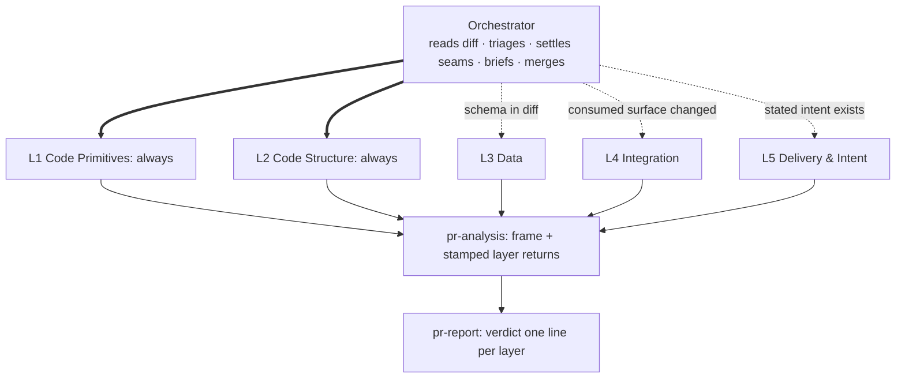

# PR review

A reviewer's real job is a set of decisions: merge or not, which risks to accept,
which questions to send back. Most review tools emit findings and leave the deciding
context in the reviewer's head. This skill produces the context: a **PR analysis
document** that describes the change, draws how the structure moved, names the blast
radius, and lists the decision points, then attaches findings, each citing its
source. It reviews in **layers**: independent subagents, each reading the change at
one altitude, dispatched only where the diff gives them material. Stack-agnostic: it
reads diffs and repo docs, not framework knowledge.

## Scope (explicit, refused when broken)

- `/pr-review <PR#>` → `node scripts/scope.mjs pr <PR#> --layers --json`
- `/pr-review <branch|ref>` → `node scripts/scope.mjs branch <ref> --layers --json`
- `/pr-review` with neither → ask for the fixed point rather than guessing.

The script (path relative to this skill) resolves the merge-base, lists the files
with the vendored, generated, build and lockfile paths already skipped, carries the
stated intent (description, linked issues, commit messages), and says which of L3 and
L5 have material with the evidence. Run it before doing anything else: exit 1 is an
empty scope, exit 2 a ref that does not resolve, and either stops the review. A
three-dot diff makes uncommitted work invisible: say so if the working tree is dirty.

**Resolve the diff and the search base to the same revision.** Reviewing by PR number
needs no checkout, so the working tree stays on whatever branch it was on, and every
integration search then runs against code that does not contain the PR: cited
`file:line`, confidently wrong. Check out the PR's head, or say plainly that the blast
radius was not repo-verified.

**Then read the repo's own conventions, before anything is dispatched**: `AGENTS.md`,
`CLAUDE.md`, architecture docs, and `project-conventions`
(`../project-conventions/SKILL.md` in this collection) where its rules apply. This is
what the stack-agnostic claim rests on. It separates *violates a house rule* (a
finding) from *unusual but unruled* (a decision point), and it is usually how you
learn that a consumer of this change lives in another repository entirely.

## The five layers

Each layer reads the change at one altitude. Two always run; three run when the diff
gives them material. **The diff decides: there is no opt-in question to the human**,
and every layer that does not run is recorded, with its reason, in the analysis and
in the verdict. A reader takes silence for coverage; a recorded skip is the
difference between *not checked* and *checked and clean*.

| Layer | Altitude | Owns | Dispatched when |
|---|---|---|---|
| **L1 Code Primitives** | how code is written | classes, types, functions, individual lines; DRY and SOLID; races visible in a function body; test code quality | **always** |
| **L2 Code Structure** | how code is organised | directories, modules, files; placement and naming; cohesion and coupling; test file placement | **always** |
| **L3 Data** | the data model | schema, ORM mappings, tables, migration files as artifacts | schema, ORM or migration files are in the diff |
| **L4 Integration** | how the change lands | blast radius: callers, consumers, contracts, other repos, config, deploy needs, migration execution order | the diff changes a surface something else consumes |
| **L5 Delivery & Intent** | why the change exists | stated intent vs the diff, feature completeness, scope creep, documentation, coverage of the stated behaviour | the PR states an intent: description, linked issue, commit messages, or a linked spec whose user stories are then the intent, checked one by one |

A PR with no stated intent skips L5 entirely: *"L5: not run, no stated intent."*
Never infer an intent so the layer has something to check against; the layer would
then be checking the code against itself.

The design lenses live here, not in a chained skill: DRY and SOLID are L1's, cohesion
and coupling are L2's. This skill **no longer chains `code-design-review`**: its
ground is covered by the always-on layers. The standalone skill remains for reviewing
existing code outside a PR.

Cost follows the diff: the floor is two agents, the ceiling five, a typical review
three or four. No layer is bought by a human; none is skipped silently.

When L5 finds a pattern the repository does not rule and that would pass the five
filters of the `project-conventions` skill, the report proposes it as a capture, in
chat; whether it becomes a rule is the person's decision.

## Two documents, two readers

A review produces two files, in the data home (ask the `aiview` skill for the path;
never in the repo under review), both registered through the `aiview` skill
(`../aiview/SKILL.md` in this collection) and both joined to the **same
group** (`pr-<id>`), so they sit together in the sidebar. Each links the other.

| | `YYYY-MM-DD-pr-<id>.report.md` | `YYYY-MM-DD-pr-<id>.pr-analysis.md` |
|---|---|---|
| Reader | the human deciding whether to merge | the next agent, and the human asking *"why does it say that?"* |
| Life | read once, now | consulted on demand, and by whoever picks this up later |
| Size | fits on one screen before the comment block | as long as the evidence needs |
| Holds | the conclusions | what earns them |

**The report makes claims; the analysis holds the evidence.** Every claim in the report
traces to a section of the analysis, and nothing appears in the report the analysis does
not support: the same rule the proposed comment already obeys toward its own document,
applied one level up. Tell the user the **report's** URL; they reach the analysis from
the group, or from the link.

Write both from the start. The report's Abstract, What changed and diagram are
knowable before any layer returns, so publish them immediately and carry one
`aiview pending` card per dispatched layer on the report: that is the document the
developer has open while they wait. The cards sit above the content and vanish as each
layer lands, replaced by the section it produced.

The sections of each document in reading order, and the report's register: read
`references/documents.md` before writing either.

**Stamp what an agent produced.** A section written from a subagent's return carries a
one-line attribution under its heading, naming the layer and what you did to its output
before believing it:

> *From L4 Integration. Merged, deduplicated, and every citation re-read before
> inclusion.*

Two reasons, and the second is the one that bites. It tells a later reader which prose
is your own synthesis and which came from an unattended worker: the card that
announced it is gone by then, and nothing else records it. And it forces you to state
the treatment, which is the difference between *an agent said this* and *I checked
this*: layers in this very skill have raised confident, well-argued findings that
another layer then refuted. Attribution is provenance, never endorsement. Sections you
wrote yourself carry no stamp; absence is the default and means exactly that.

## Diagrams

Diagrams: use the `write-diagrams` skill (`../write-diagrams/SKILL.md` in
this collection): pick from its catalog by the reviewer's question, follow its
discipline. PR-specific guidance: draw the **delta**, not the whole system:

- **Change map** (almost always): the components the PR touches and their edges:
  new edges and nodes marked, removed ones dashed. A reviewer orients on this in
  seconds; the diff alone never shows it.
- **Behavior change**: when the PR changes an ordering (a flow, a handshake, a
  retry), a sequence diagram of the *new* behavior, failure branches included;
  before/after as two small diagrams only when the contrast is the point.
- **Schema change**: ER diagram of the touched entities, changed
  relations marked.
- **Lifecycle change**: state machine when the PR adds or removes legal states.

**Which document gets which.** The **change map is the report's**: it is the fastest
orientation a reviewer will get, and it belongs where they are looking. Every other
diagram supports a specific finding and belongs in the **analysis**, next to what it
explains. A diagram in the report must earn a screen it is competing for.

One diagram per question a reviewer would actually ask; a big PR usually earns 2–3
across both documents, a small one often only the change map, and a trivial one none
(then say so).

## Running the layers

Who owns a question when altitudes touch (the seam table), what the four slots of a
brief are, and what a return contains: read `references/layers.md` before dispatch.
No two agents in a review ever hold the same question.

Triage first, in this session: L3 and L5 come from the script's `layers` (a layer it
calls material is dispatched, one it calls nothing is recorded as not run), L4 is
your call from the diff. Settle every seam the review will meet and establish the
shared facts. Then publish
both documents, the reader gets the change described and drawn without waiting, with
one `aiview pending` card per dispatched layer, closed as each return lands.

Each dispatched layer is an **independent fresh-context subagent**: it gets only the
diff, its brief, and the output contract; no conversation history, no opinion of the
change inherited from this session, and the explicit instruction: *"Do not invoke
skills or spawn agents: review directly."*

### The merge

Then merge, in this session: dedup, rank by cost, drop anything the project's own
linter/CI already flags. A finding outside its layer's jurisdiction is dropped from
that return: if it matters, it is re-verified under the owning layer's ground and
attributed honestly. A finding that implicates a skipped layer's ground reopens the
triage: say so, and either dispatch the layer or record why not. Findings are
hypotheses until the citation is read: re-verify the ones that carry the verdict
yourself, because a well-argued wrong finding reaches the author in your name.

## Beyond the layers

- **A correctness bug hunt**: the harness's own review, where the harness has one.
  The layers do not run one: if nothing does, nobody is checking whether the code
  works, and the verdict has to say so, every time.
- **`frontend-review`** (`../frontend-review/SKILL.md`): chained, opt-in, only on a
  project it declares support for and only when the diff has frontend in it. Never
  started without an explicit yes; usually the answer is *not applicable*, which you
  say rather than leave out.

**However it was decided, the document records it**: *"Chained: frontend-review
(link). Correctness: not covered."* Left implicit, the default is silently *none*, and
a review that never looked reads exactly like one that looked and found nothing.

## Red flags

| Thought | Reality |
|---|---|
| "I'll infer the intent from the code" | Then L5 checks the code against itself. No stated intent → L5 is skipped, and the verdict says so. |
| "The L1 agent also flagged a schema issue, bonus" | Out of its jurisdiction. Drop it from the return; re-verify it under L3's ground if it matters. |
| "This matters, so I'll ask two layers to check it" | Then it is investigated twice, in full, by agents who cannot see each other. Every question has one owner; the seam table or you, before dispatch. |
| "I'll mention what I suspect so the layer looks there" | It will look there, and it will come back with your suspicion, right or wrong. Name the surface, keep the hypothesis. |
| "One overall score for the PR" | A blended verdict hides the failing layer. One line per layer + open decisions. |
| "The diff shows what changed" | The diff shows lines. The change map and blast radius are what the reviewer lacks. |
| "I reviewed it in the session that wrote it" | That's confirmation bias with a slash command. Fresh context, or at least fresh subagents. |
| "More findings = better review" | The deliverable is decisions the human can make. Ten cited findings beat forty hunches. |
| "The code around it is a mess too" | Not this PR's bill. Note it, attribute it, approve anyway. |
| "Unverifiable from here, so it blocks" | Ask the author. A question they can answer in one line is not a change request. |
| "The proposed comment is the deliverable" | The report is. The comment is its condensate, and the analysis is what earns them both. |
| "The recommendation decides the merge" | It drafts the reviewer's words. They post it only if they agree: the decision stays theirs. |
